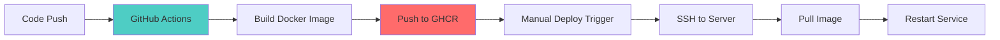
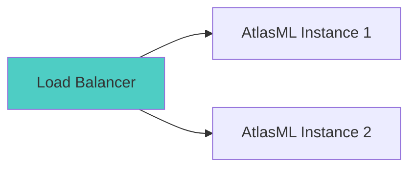

# AtlasML Deployment Guide

This guide covers deployment workflows, CI/CD integration, and production deployment strategies for AtlasML.

---

## Deployment Overview

AtlasML uses a containerized deployment model with GitHub Actions for CI/CD:



---

## GitHub Actions Workflows

### 1. Build and Push Docker Image

**File**: `.github/workflows/atlas_build-and-push-docker.yml`

This workflow automatically builds and pushes Docker images when code changes.

#### Trigger Conditions

```yaml
on:
  push:
    paths:
      - 'atlas/**'
      - '.github/workflows/atlas_build-and-push-docker.yml'
  release:
    types:
      - created
```

**Triggers on**:
- Any push to `atlas/` directory
- Workflow file changes
- New GitHub release

#### What It Does

1. **Builds Docker image** using `/atlas/AtlasMl/Dockerfile`
2. **Tags image** with:
   - Branch name (e.g., `main`, `feature-branch`)
   - PR number (e.g., `pr-123`)
   - Release version (e.g., `v1.2.0`)
3. **Pushes to GitHub Container Registry** (`ghcr.io`)

#### Usage

**Automatic (on push)**:
```bash
# Make changes
git add atlas/AtlasMl/
git commit -m "Update AtlasML"
git push

# GitHub Actions automatically builds and pushes image
# Result: ghcr.io/ls1intum/edutelligence/atlasml:main
```

**Manual trigger**:
1. Go to GitHub Actions tab
2. Select "AtlasML - Build Docker Images"
3. Click "Run workflow"
4. Select branch
5. Click "Run workflow"

---

### 2. Deploy to Test Environment

**File**: `.github/workflows/atlas_deploy-test.yml`

Manual deployment workflow for test/staging environments.

#### Workflow Configuration

```yaml
name: AtlasML - Deploy to Test 1

on:
  workflow_dispatch:
    inputs:
      image-tag:
        type: string
        description: 'Image tag to deploy (default: pr-<number> if PR exists, latest for default branch)'
      deploy-atlasml:
        type: boolean
        default: true
        description: (Re-)deploys AtlasML.
```

#### Required GitHub Configuration

The workflow uses the organization's standard naming conventions for secrets and variables.

**Environment Variables** (in GitHub Environment `Atlas - Test 1`):
- `VM_HOST` - Target server hostname/IP
- `VM_USERNAME` - SSH username

**Environment Secrets** (in GitHub Environment `Atlas - Test 1`):
- `VM_SSH_PRIVATE_KEY` - SSH private key for server access
- All application secrets (e.g., `WEAVIATE_HOST`, `WEAVIATE_API_KEY`, `OPENAI_API_KEY`, etc.)

:::tip
The reusable deployment workflow automatically creates the `.env` file from all secrets configured in the GitHub environment, excluding infrastructure secrets like `VM_SSH_PRIVATE_KEY`.
:::

#### Steps

**Step 1: Provision Environment**

Sets up Traefik directories and SSL certificate file on the remote server:

```yaml
- name: Setup Traefik on remote host
  uses: appleboy/ssh-action@v1.2.4
  with:
    host: ${{ vars.VM_HOST }}
    username: ${{ vars.VM_USERNAME }}
    key: ${{ secrets.VM_SSH_PRIVATE_KEY }}
    script: |
      sudo mkdir -p /opt/atlasml/traefik
      sudo touch /opt/atlasml/traefik/acme.json
      sudo chmod 600 /opt/atlasml/traefik/acme.json
```

:::note
The `.env` file is automatically created by the reusable deployment workflow using secrets and variables configured in the GitHub environment. You don't need to manually write environment variables.
:::

**Step 2: Deploy AtlasML**

Uses the organization's reusable workflow to deploy:

```yaml
- name: Deploy AtlasML
  uses: ls1intum/.github/.github/workflows/deploy-docker-compose.yml@main
  with:
    environment: 'Atlas - Test 1'
    docker-compose-file: './atlas/docker-compose.prod.yml'
    main-image-name: ls1intum/edutelligence/atlasml
    image-tag: ${{ inputs.image-tag }}
    deployment-base-path: '/opt/atlasml'
  secrets: inherit
```

#### How to Deploy

1. **Go to GitHub Actions**
   - Navigate to repository → Actions tab

2. **Select Workflow**
   - Click "AtlasML - Deploy to Test 1"

3. **Run Workflow**
   - Click "Run workflow" button
   - Select branch (usually `main`)
   - Enter image tag:
     - Branch name: `main`
     - PR number: `pr-123`
     - Version: `v1.2.0`
   - Click "Run workflow"

4. **Monitor Progress**
   - Watch workflow execution in real-time
   - Check logs for any errors

**Example**:
```
Image tag: main
Deploy AtlasML: ✓ (checked)
```

---

## Deployment Strategies

### Strategy 1: Continuous Deployment (Dev/Test)

For development and test environments, deploy automatically on every push.

```yaml
# Add to .github/workflows/atlas_deploy-test.yml
on:
  push:
    branches:
      - develop
    paths:
      - 'atlas/**'
```

**Flow**:
```
Code Push → Auto Build → Auto Deploy to Test
```

### Strategy 2: Manual Deployment (Staging)

For staging, require manual approval.

```yaml
jobs:
  deploy:
    environment:
      name: staging
      # Requires manual approval
```

**Flow**:
```
Code Push → Auto Build → Manual Approval → Deploy to Staging
```

### Strategy 3: Release-Based Deployment (Production)

For production, only deploy tagged releases.

```yaml
on:
  release:
    types:
      - published
```

**Flow**:
```
Create Release → Auto Build → Manual Deploy with Version Tag → Production
```

---

## Production Deployment Process

### Step-by-Step Production Deployment

#### 1. Prepare Release

```bash
# Ensure main branch is stable
git checkout main
git pull origin main

# Run tests locally
cd atlas/AtlasMl
poetry run pytest

# Check for linting issues
poetry run ruff check .
poetry run black --check .
```

#### 2. Create GitHub Release

```bash
# Create and push tag
git tag -a v1.2.0 -m "Release version 1.2.0"
git push origin v1.2.0
```

Or via GitHub UI:
1. Go to Releases → Draft a new release
2. Choose tag: Create new tag `v1.2.0`
3. Title: `AtlasML v1.2.0`
4. Description: Release notes
5. Click "Publish release"

#### 3. Wait for Image Build

GitHub Actions automatically:
- Builds Docker image
- Tags as `v1.2.0`
- Pushes to `ghcr.io/ls1intum/edutelligence/atlasml:v1.2.0`

Monitor at: Actions → "AtlasML - Build Docker Images"

#### 4. Deploy to Production

1. Go to Actions → "AtlasML - Deploy to Production"
2. Click "Run workflow"
3. Enter image tag: `v1.2.0`
4. Click "Run workflow"
5. Monitor deployment logs

#### 5. Verify Deployment

```bash
# SSH to production server
ssh production-server

# Check container status
docker ps | grep atlasml

# Check health
curl http://localhost/api/v1/health

# Check logs
docker logs atlasml --tail 50

# Test endpoint
curl -X POST http://localhost/api/v1/competency/suggest \
  -H "Authorization: your-api-key" \
  -H "Content-Type: application/json" \
  -d '{"description":"Python programming","course_id":1}'
```

#### 6. Monitor Post-Deployment

- Check Sentry for errors (if configured)
- Monitor logs for first hour
- Verify Artemis integration working
- Check response times

---

## Rollback Procedure

If deployment fails or issues are discovered:

### Quick Rollback

```bash
# SSH to server
ssh production-server

cd /opt/atlasml

# Set previous version in .env
echo "IMAGE_TAG=v1.1.0" > .env.new
cat .env >> .env.new
mv .env.new .env

# Pull and restart
docker-compose -f docker-compose.prod.yml pull
docker-compose -f docker-compose.prod.yml up -d

# Verify
docker logs atlasml
curl http://localhost/api/v1/health
```

### Rollback via GitHub Actions

1. Go to Actions → "AtlasML - Deploy to Production"
2. Click "Run workflow"
3. Enter previous image tag: `v1.1.0`
4. Click "Run workflow"

---

## Zero-Downtime Deployment

For high-availability setups:

### Using Load Balancer



**Process**:
1. Deploy new version to Instance 2
2. Wait for health check to pass
3. Load balancer routes traffic to Instance 2
4. Update Instance 1
5. Both instances now running new version

### Using Docker Compose

```yaml
# docker-compose.prod.yml
services:
  atlasml:
    image: ghcr.io/ls1intum/edutelligence/atlasml:${IMAGE_TAG}
    deploy:
      replicas: 2
      update_config:
        parallelism: 1
        delay: 10s
        order: start-first
```

**Deploy**:
```bash
docker-compose -f docker-compose.prod.yml up -d --no-deps --build atlasml
```

This updates containers one at a time, ensuring at least one is always running.

---

## Environment-Specific Configurations

### Development

```yaml
# .env.dev
ENV=development
ATLAS_API_KEYS=dev-key
WEAVIATE_HOST=localhost
OPENAI_API_KEY=dev-key
```

### Staging

```yaml
# .env.staging
ENV=staging
ATLAS_API_KEYS=staging-key-1,staging-key-2
WEAVIATE_HOST=weaviate-staging.internal
OPENAI_API_KEY=staging-key
SENTRY_DSN=https://...@sentry.../staging
```

### Production

```yaml
# .env.production
ENV=production
ATLAS_API_KEYS=prod-key-1,prod-key-2,prod-key-3
WEAVIATE_HOST=weaviate.internal
OPENAI_API_KEY=prod-key
SENTRY_DSN=https://...@sentry.../production
```

---

## Automated Deployment with CI/CD

### Full CI/CD Pipeline

```yaml
# .github/workflows/atlas_ci_cd.yml
name: AtlasML CI/CD

on:
  push:
    branches: [main, develop]
  pull_request:
    branches: [main]

jobs:
  test:
    runs-on: ubuntu-latest
    steps:
      - uses: actions/checkout@v3
      - name: Set up Python
        uses: actions/setup-python@v4
        with:
          python-version: '3.13'
      - name: Install dependencies
        run: |
          cd atlas/AtlasMl
          pip install poetry
          poetry install
      - name: Run tests
        run: |
          cd atlas/AtlasMl
          poetry run pytest
      - name: Lint
        run: |
          cd atlas/AtlasMl
          poetry run ruff check .

  build:
    needs: test
    if: github.ref == 'refs/heads/main'
    runs-on: ubuntu-latest
    steps:
      - uses: actions/checkout@v3
      - name: Build and push Docker image
        # Build image

  deploy-test:
    needs: build
    if: github.ref == 'refs/heads/develop'
    runs-on: ubuntu-latest
    steps:
      - name: Deploy to test
        # Deploy to test environment

  deploy-prod:
    needs: build
    if: github.event_name == 'release'
    runs-on: ubuntu-latest
    environment:
      name: production
    steps:
      - name: Deploy to production
        # Deploy to production
```

---

## Deployment Checklist

### Pre-Deployment

- [ ] Tests passing locally
- [ ] Code reviewed and approved
- [ ] Documentation updated
- [ ] CHANGELOG updated
- [ ] Version bumped (if applicable)
- [ ] Database migrations prepared (if needed)
- [ ] Backup of current production data

### During Deployment

- [ ] Monitor GitHub Actions logs
- [ ] Watch container startup logs
- [ ] Verify health check passing
- [ ] Check Sentry for errors
- [ ] Test critical endpoints

### Post-Deployment

- [ ] Verify Artemis integration
- [ ] Check response times
- [ ] Monitor error rates
- [ ] Update deployment docs
- [ ] Notify team of successful deployment

---

## Deployment Troubleshooting

### Issue: Image Pull Fails

**Error**: `Error response from daemon: pull access denied`

**Solution**:
```bash
# Login to GHCR
echo $GITHUB_TOKEN | docker login ghcr.io -u USERNAME --password-stdin

# Or ensure image is public
```

### Issue: Container Starts But Unhealthy

**Check**:
```bash
# View health check logs
docker inspect atlasml | grep -A 10 Health

# Test endpoint manually
docker exec atlasml curl http://localhost:8000/api/v1/health

# Check application logs
docker logs atlasml
```

**Common causes**:
- Weaviate connection failed
- Missing environment variables
- OpenAI API key invalid

### Issue: Old Version Still Running

**Solution**:
```bash
# Force pull new image
docker-compose -f docker-compose.prod.yml pull

# Remove old container
docker-compose -f docker-compose.prod.yml down

# Start with new image
docker-compose -f docker-compose.prod.yml up -d

# Verify version (check logs for startup message)
docker logs atlasml | grep "Starting"
```

---

## Monitoring Deployments

### Deployment Metrics

Track these metrics during and after deployment:

- **Response Time**: Should remain stable
- **Error Rate**: Should not increase
- **Memory Usage**: Check for memory leaks
- **CPU Usage**: Should be within normal range

### Using Sentry

If Sentry is configured, monitor:

```bash
# Check Sentry dashboard at
https://sentry.io/organizations/your-org/issues/

# Filter by:
- Environment: production
- Time: Last hour
- Release: v1.2.0
```

### Using Docker Stats

```bash
# Monitor resource usage
docker stats atlasml

# Output:
# CONTAINER  CPU %  MEM USAGE/LIMIT    MEM %
# atlasml    2.5%   256MB/2GB          12.8%
```

---

## Next Steps

- **[Configuration](./atlasml-configuration.md)**: Manage environment variables and secrets
- **[Monitoring](./atlasml-monitoring.md)**: Set up comprehensive monitoring
- **[Troubleshooting](./atlasml-troubleshooting.md)**: Resolve production issues

---

## Resources

- **GitHub Actions Documentation**: https://docs.github.com/en/actions
- **Docker Compose**: https://docs.docker.com/compose/
- **GHCR**: https://docs.github.com/en/packages
- **SSH Actions**: https://github.com/appleboy/ssh-action
