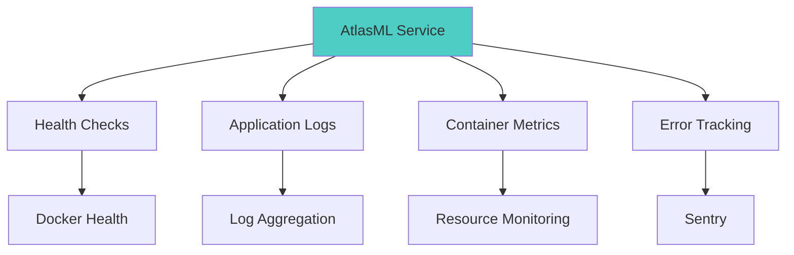

# AtlasML Monitoring Guide

This guide covers how to monitor AtlasML in production, including health checks, logging, metrics, error tracking, and alerting.

---

## Monitoring Overview

Effective monitoring ensures AtlasML runs reliably in production:



---

## Health Checks

### Built-in Health Endpoint

AtlasML provides a health check endpoint:

```bash
# Check health
curl http://localhost/api/v1/health

# Expected response
[]

# HTTP 200 = healthy
# Non-200 = unhealthy
```

**What it checks**:
- Application is running
- Can respond to requests
- Basic connectivity

**Does NOT check**:
- Weaviate connectivity
- OpenAI API availability
- Database integrity

---

### Docker Health Check

Configured in `docker-compose.prod.yml`:

```yaml
healthcheck:
  test: ["CMD", "python", "-c", "import urllib.request; import sys; sys.exit(0 if urllib.request.urlopen('http://localhost:8000/api/v1/health').getcode() == 200 else 1)"]
  interval: 30s
  timeout: 10s
  retries: 3
  start_period: 30s
```

:::note
The health check uses Python's `urllib` instead of `curl` because `curl` is not installed in the slim Python Docker image. This approach is more reliable and doesn't require additional dependencies.
:::

**Parameters**:
- `interval`: Check every 30 seconds
- `timeout`: Fail if no response in 10s
- `retries`: Mark unhealthy after 3 consecutive failures
- `start_period`: Grace period during startup

**Check status**:
```bash
# View health status
docker ps

# Output:
# CONTAINER  IMAGE     STATUS
# atlasml    ...       Up 5 minutes (healthy)

# If unhealthy:
# atlasml    ...       Up 5 minutes (unhealthy)
```

**View health check logs**:
```bash
docker inspect atlasml | jq '.[0].State.Health'
```

**Output**:
```json
{
  "Status": "healthy",
  "FailingStreak": 0,
  "Log": [
    {
      "Start": "2025-01-15T10:00:00Z",
      "End": "2025-01-15T10:00:01Z",
      "ExitCode": 0,
      "Output": "[]"
    }
  ]
}
```

---

### Custom Health Checks

For more comprehensive checks, add custom endpoints:

**Check Weaviate connectivity**:
```bash
curl http://localhost/api/v1/health/weaviate
```

**Check OpenAI API**:
```bash
curl http://localhost/api/v1/health/openai
```

:::note
These endpoints don't exist by default. See Developer Guide to implement.
:::

---

## Logging

### Application Logs

**View logs**:
```bash
# Real-time logs
docker logs -f atlasml

# Last 100 lines
docker logs --tail 100 atlasml

# Since specific time
docker logs --since "2025-01-15T10:00:00" atlasml

# With timestamps
docker logs -f --timestamps atlasml
```

**Example log output**:
```
2025-01-15 10:30:45 INFO:     Started server process [1]
2025-01-15 10:30:45 INFO:     Waiting for application startup.
2025-01-15 10:30:45 INFO:     Application startup complete.
2025-01-15 10:30:45 INFO:     Uvicorn running on http://0.0.0.0:8000
2025-01-15 10:31:12 INFO:     POST /api/v1/competency/suggest HTTP/1.1 200
2025-01-15 10:31:15 INFO:     GET /api/v1/health HTTP/1.1 200
```

---

### Log Levels

AtlasML uses standard Python logging levels:

| Level | When to Use |
|-------|-------------|
| `DEBUG` | Detailed debugging info |
| `INFO` | General informational messages |
| `WARNING` | Warning messages (non-critical issues) |
| `ERROR` | Error messages (failures) |
| `CRITICAL` | Critical failures (service down) |

**Filter by level**:
```bash
# Only errors
docker logs atlasml 2>&1 | grep ERROR

# Only warnings and errors
docker logs atlasml 2>&1 | grep -E "(WARNING|ERROR)"
```

---

### Log Rotation

Configured in `docker-compose.prod.yml`:

```yaml
logging:
  driver: 'json-file'
  options:
    max-size: '50m'
    max-file: '5'
```

**Settings**:
- `max-size`: 50MB per log file
- `max-file`: Keep 5 files
- **Total max**: 250MB of logs

**Benefits**:
- Prevents disk space issues
- Automatic cleanup
- Maintains history

**Check log files**:
```bash
# Find log files
sudo ls -lh /var/lib/docker/containers/$(docker ps -q -f name=atlasml)/*.log

# Total size
sudo du -sh /var/lib/docker/containers/$(docker ps -q -f name=atlasml)
```

---

### Centralized Logging

For production, send logs to a centralized system:

#### Option 1: Syslog

```yaml
# docker-compose.prod.yml
logging:
  driver: syslog
  options:
    syslog-address: "tcp://syslog.company.com:514"
    tag: "atlasml"
```

#### Option 2: Fluentd

```yaml
logging:
  driver: fluentd
  options:
    fluentd-address: "fluentd.company.com:24224"
    tag: "atlasml"
```

#### Option 3: ELK Stack (Elasticsearch, Logstash, Kibana)

```yaml
logging:
  driver: gelf
  options:
    gelf-address: "udp://logstash.company.com:12201"
    tag: "atlasml"
```

#### Option 4: CloudWatch (AWS)

```yaml
logging:
  driver: awslogs
  options:
    awslogs-region: "us-east-1"
    awslogs-group: "atlasml"
    awslogs-stream: "production"
```

---

## Resource Monitoring

### Container Resource Usage

**Real-time stats**:
```bash
docker stats atlasml

# Output:
# CONTAINER  CPU %  MEM USAGE/LIMIT    MEM %  NET I/O        BLOCK I/O
# atlasml    2.5%   256MB/2GB          12.8%  1.2MB/500KB    10MB/5MB
```

**Monitor continuously**:
```bash
# Update every 2 seconds
docker stats atlasml --no-stream=false

# Format output
docker stats atlasml --format "table {{.Container}}\t{{.CPUPerc}}\t{{.MemUsage}}"
```

---

### Set Resource Limits

Prevent resource exhaustion:

```yaml
# docker-compose.prod.yml
services:
  atlasml:
    deploy:
      resources:
        limits:
          cpus: '2.0'
          memory: 2G
        reservations:
          cpus: '1.0'
          memory: 512M
```

**Limits**:
- `cpus`: Max 2 CPU cores
- `memory`: Max 2GB RAM

**Reservations**:
- `cpus`: Guaranteed 1 core
- `memory`: Guaranteed 512MB

**Monitor against limits**:
```bash
docker stats atlasml --no-stream

# If MEM % approaches 100%, increase limit or optimize code
```

---

### Disk Usage

**Check container disk usage**:
```bash
docker system df

# Output:
# TYPE           TOTAL    ACTIVE   SIZE      RECLAIMABLE
# Images         10       2        5.2GB     3.1GB (59%)
# Containers     5        2        100MB     50MB (50%)
# Local Volumes  3        2        2GB       500MB (25%)
```

**Check Weaviate data volume**:
```bash
docker volume inspect weaviate-data | jq '.[0].Mountpoint'
sudo du -sh $(docker volume inspect weaviate-data | jq -r '.[0].Mountpoint')
```

**Clean up unused resources**:
```bash
# Remove unused images
docker image prune -a

# Remove unused volumes (CAREFUL!)
docker volume prune

# Full cleanup
docker system prune -a --volumes
```

---

## Error Tracking with Sentry

### Setup Sentry

1. **Create account**: https://sentry.io
2. **Create project**: Select "Python" → "FastAPI"
3. **Get DSN**: Copy from project settings

**Configure in .env**:
```bash
SENTRY_DSN=https://YOUR_SENTRY_KEY@YOUR_ORG.ingest.sentry.io/YOUR_PROJECT_ID
ENV=production
```

---

### What Sentry Captures

- **Unhandled exceptions**
- **API endpoint errors**
- **Performance metrics**
- **User context** (IP, endpoint, request data)
- **Stack traces**
- **Breadcrumbs** (events leading to error)

**Example error in Sentry**:
```
WeaviateConnectionError: Could not connect to Weaviate at localhost:8085

Stack trace:
  File "atlasml/routers/competency.py", line 45, in suggest_competencies
    embeddings = weaviate_client.get_embeddings()
  File "atlasml/clients/weaviate.py", line 120, in get_embeddings
    raise WeaviateConnectionError(...)

Environment: production
Release: v1.2.0
User IP: 192.168.1.100
Endpoint: POST /api/v1/competency/suggest
```

---

### Monitoring Sentry

**Access dashboard**:
```
https://sentry.io/organizations/your-org/issues/
```

**Filter by**:
- Environment (`production`, `staging`, `development`)
- Release version (`v1.2.0`)
- Time range (last hour, day, week)
- Error type
- Endpoint

**Key metrics**:
- **Error frequency**: Errors per hour
- **Affected users**: Number of unique IPs/users
- **First seen**: When error first occurred
- **Last seen**: Most recent occurrence

---

### Alert Rules

Set up alerts for critical errors:

**Example: Alert on 10+ errors in 5 minutes**

1. Go to Sentry → Alerts → Create Alert Rule
2. Conditions:
   - When: `10` events occur
   - In: `5 minutes`
   - For project: `atlasml`
   - Environment: `production`
3. Actions:
   - Send email to: `ops@company.com`
   - Send Slack notification to: `#alerts`

---

## Performance Monitoring

### Response Time Monitoring

**Manual testing**:
```bash
# Measure response time
time curl -X POST http://localhost/api/v1/competency/suggest \
  -H "Authorization: your-key" \
  -H "Content-Type: application/json" \
  -d '{"description":"test","course_id":1}'

# Output:
# real    0m0.342s  ← Total time
```

**Load testing with Apache Bench**:
```bash
# Install
sudo apt-get install apache2-utils

# Run 100 requests, 10 concurrent
ab -n 100 -c 10 \
  -H "Authorization: your-key" \
  -H "Content-Type: application/json" \
  -p request.json \
  http://localhost/api/v1/competency/suggest

# Results:
# Requests per second: 29.12 [#/sec]
# Time per request: 34.343 [ms] (mean)
# Time per request: 3.434 [ms] (mean, across all concurrent)
```

---

### Using Prometheus and Grafana

For advanced metrics, integrate Prometheus:

#### 1. Add Prometheus Exporter

```bash
# Install prometheus-client
poetry add prometheus-client
```

**Add to app.py**:
```python
from prometheus_client import make_asgi_app

# Add Prometheus metrics endpoint
metrics_app = make_asgi_app()
app.mount("/metrics", metrics_app)
```

#### 2. Configure Prometheus

```yaml
# prometheus.yml
scrape_configs:
  - job_name: 'atlasml'
    static_configs:
      - targets: ['atlasml:8000']
    metrics_path: '/metrics'
    scrape_interval: 15s
```

#### 3. Run Prometheus

```yaml
# docker-compose.monitoring.yml
services:
  prometheus:
    image: prom/prometheus
    ports:
      - "9090:9090"
    volumes:
      - ./prometheus.yml:/etc/prometheus/prometheus.yml
    networks:
      - shared-network
```

#### 4. Set Up Grafana

```yaml
  grafana:
    image: grafana/grafana
    ports:
      - "3000:3000"
    environment:
      - GF_SECURITY_ADMIN_PASSWORD=admin
    volumes:
      - grafana-data:/var/lib/grafana
    networks:
      - shared-network
```

**Access**: http://localhost:3000 (admin/admin)

**Add Prometheus data source**:
- URL: `http://prometheus:9090`

**Create dashboard** with metrics:
- Request rate
- Response time (p50, p95, p99)
- Error rate
- CPU/Memory usage
- Weaviate query time

---

## Alerting

### Docker Health-Based Alerts

**Script to check and alert**:

```bash
#!/bin/bash
# check-health.sh

CONTAINER="atlasml"
STATUS=$(docker inspect -f '{{.State.Health.Status}}' $CONTAINER 2>/dev/null)

if [ "$STATUS" != "healthy" ]; then
    echo "⚠️ ALERT: AtlasML is $STATUS"
    # Send alert (examples below)
fi
```

**Send email alert**:
```bash
echo "AtlasML is unhealthy!" | mail -s "AtlasML Alert" ops@company.com
```

**Send Slack alert**:
```bash
curl -X POST https://hooks.slack.com/services/YOUR/WEBHOOK/URL \
  -H 'Content-Type: application/json' \
  -d '{"text":"⚠️ AtlasML is unhealthy!"}'
```

**Run as cron job**:
```bash
# Check every 5 minutes
*/5 * * * * /opt/atlasml/check-health.sh
```

---

### Log-Based Alerts

**Alert on specific errors**:

```bash
#!/bin/bash
# alert-on-errors.sh

ERRORS=$(docker logs atlasml --since 5m 2>&1 | grep -c "ERROR")

if [ $ERRORS -gt 10 ]; then
    echo "⚠️ $ERRORS errors in last 5 minutes!" | \
        mail -s "AtlasML Errors" ops@company.com
fi
```

---

### Resource-Based Alerts

**Alert on high memory usage**:

```bash
#!/bin/bash
# alert-memory.sh

MEM_PERCENT=$(docker stats atlasml --no-stream --format "{{.MemPerc}}" | sed 's/%//')

if (( $(echo "$MEM_PERCENT > 80" | bc -l) )); then
    echo "⚠️ Memory usage at ${MEM_PERCENT}%!" | \
        mail -s "AtlasML Memory Alert" ops@company.com
fi
```

---

## Monitoring Dashboard Example

### Simple Monitoring Script

```bash
#!/bin/bash
# monitor-atlasml.sh

echo "=== AtlasML Monitoring Dashboard ==="
echo ""

# Health status
echo "Health Status:"
HEALTH=$(docker inspect -f '{{.State.Health.Status}}' atlasml 2>/dev/null || echo "unknown")
echo "  Status: $HEALTH"
echo ""

# Resource usage
echo "Resource Usage:"
docker stats atlasml --no-stream --format "  CPU: {{.CPUPerc}}\n  Memory: {{.MemUsage}}\n  Network: {{.NetIO}}"
echo ""

# Recent errors
echo "Recent Errors (last 5):"
docker logs atlasml --since 1h 2>&1 | grep ERROR | tail -5
echo ""

# Request rate (approximate)
echo "Request Rate (last minute):"
REQUESTS=$(docker logs atlasml --since 1m 2>&1 | grep -c "POST\\|GET")
echo "  $REQUESTS requests"
echo ""

# Uptime
echo "Uptime:"
docker inspect -f '{{.State.StartedAt}}' atlasml
echo ""
```

**Run**:
```bash
chmod +x monitor-atlasml.sh
./monitor-atlasml.sh
```

**Output**:
```
=== AtlasML Monitoring Dashboard ===

Health Status:
  Status: healthy

Resource Usage:
  CPU: 2.5%
  Memory: 256MB / 2GB
  Network: 1.2MB / 500KB

Recent Errors (last 5):
  (no errors found)

Request Rate (last minute):
  15 requests

Uptime:
  2025-01-15T10:00:00Z
```

---

## Monitoring Checklist

### Daily

- [ ] Check health status
- [ ] Review error logs (last 24h)
- [ ] Check resource usage trends
- [ ] Verify Sentry dashboard (if configured)

### Weekly

- [ ] Review disk usage
- [ ] Check log file sizes
- [ ] Review Weaviate data volume growth
- [ ] Analyze response time trends
- [ ] Review alert frequency

### Monthly

- [ ] Update monitoring scripts
- [ ] Review and adjust alert thresholds
- [ ] Audit Sentry issues
- [ ] Plan capacity upgrades if needed
- [ ] Review and rotate API keys

---

## Troubleshooting Monitoring Issues

### Health Check Always Failing

**Check**:
```bash
# Test endpoint manually
curl http://localhost:8000/api/v1/health

# If works, check Docker health config
docker inspect atlasml | jq '.[0].Config.Healthcheck'
```

### No Logs Appearing

**Check**:
```bash
# Verify logging driver
docker inspect atlasml | jq '.[0].HostConfig.LogConfig'

# Check log file exists
sudo ls -l /var/lib/docker/containers/$(docker ps -q -f name=atlasml)/*.log
```

### Sentry Not Receiving Errors

**Check**:
```bash
# Verify SENTRY_DSN set
docker exec atlasml printenv SENTRY_DSN

# Test Sentry connection
docker exec atlasml python -c "from sentry_sdk import capture_message; capture_message('test')"
```

---

## Next Steps

- **[Installation](./atlasml-installation.md)**: Set up monitoring during installation
- **[Deployment](./atlasml-deployment.md)**: Deploy with monitoring enabled
- **[Configuration](./atlasml-configuration.md)**: Configure Sentry and logging
- **[Troubleshooting](./atlasml-troubleshooting.md)**: Use monitoring to debug issues

---

## Resources

- **Docker Logging**: https://docs.docker.com/config/containers/logging/
- **Sentry Documentation**: https://docs.sentry.io/
- **Prometheus**: https://prometheus.io/docs/
- **Grafana**: https://grafana.com/docs/
- **Docker Health Checks**: https://docs.docker.com/engine/reference/builder/#healthcheck
