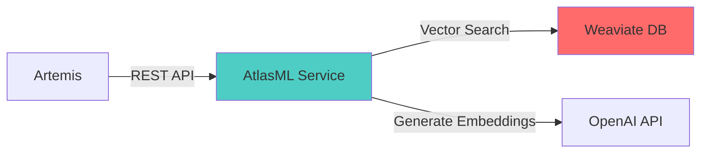

# AtlasML Administration Guide

This guide is for system administrators deploying and operating AtlasML in production environments.

---

## What is AtlasML?

**AtlasML** is a FastAPI-based microservice that provides AI-powered competency suggestions and relationship detection for the Artemis learning platform.

### Key Capabilities

- **Competency Suggestions**: Semantic search for similar competencies using ML embeddings
- **Relationship Detection**: Automatically discover prerequisite and extension relationships
- **Semantic Clustering**: Group related competencies into clusters
- **Vector Database**: Weaviate-powered semantic search with sub-100ms queries

### Technology Stack

- **FastAPI**: Python web framework
- **Weaviate**: Vector database for embeddings
- **OpenAI API**: High-quality text embeddings (Azure)
- **Docker**: Containerized deployment
- **Poetry**: Python dependency management

---

## Quick Navigation

### For First-Time Setup

1. **[Installation](./atlasml-installation.md)**: Install AtlasML on your server
2. **[Configuration](./atlasml-configuration.md)**: Configure environment variables and secrets
3. **[Deployment](./atlasml-deployment.md)**: Deploy to production

### For Day-to-Day Operations

- **[Monitoring](./atlasml-monitoring.md)**: Monitor health, logs, and performance
- **[Troubleshooting](./atlasml-troubleshooting.md)**: Resolve common production issues

---

## Architecture Overview



**Communication**:
- **Unidirectional**: Artemis calls AtlasML via REST API (AtlasML never calls Artemis)
- **Stateful**: AtlasML stores embeddings and metadata in Weaviate
- **Token-based Auth**: API key authentication for all requests

---

## System Requirements

### Minimum Requirements

- **CPU**: 2 cores
- **RAM**: 2GB
- **Disk**: 10GB (+ storage for Weaviate data)
- **OS**: Linux (Ubuntu 20.04+ recommended)
- **Docker**: 20.10+
- **Docker Compose**: 2.0+

### Network Requirements

- **Outbound**:
  - OpenAI API: `https://*.openai.azure.com` (port 443)
  - Docker registries: `ghcr.io` (port 443)

- **Inbound**:
  - Artemis server (port 8000 or custom)

### Recommended Production Setup

- **CPU**: 4+ cores
- **RAM**: 4GB+
- **Disk**: 50GB SSD
- **Load Balancer**: For high availability
- **Monitoring**: Sentry, Prometheus, or similar

---

## Deployment Options

### Option 1: Docker Compose (Recommended)

- Simple single-server deployment
- Includes Weaviate and AtlasML
- Automatic restarts
- Log rotation
- Health checks

**Best for**: Single institution, moderate load

### Option 2: Kubernetes

- Multi-node deployment
- Auto-scaling
- High availability
- Advanced monitoring

**Best for**: Large institutions, high load

### Option 3: Manual Installation

- Direct Python installation
- More control
- Requires manual updates

**Best for**: Development or testing only

---

## Security Considerations

### Authentication

- AtlasML uses **API key authentication**
- Keys configured via `ATLAS_API_KEYS` environment variable
- Must use HTTPS in production to protect keys

### Data Privacy

- **No PII stored**: Only competency text and embeddings
- **Embeddings are semantic**: Cannot reverse-engineer original text perfectly
- **Course isolation**: Data filtered by `course_id`

### Network Security

- Place AtlasML behind firewall
- Only allow connections from Artemis server
- Use HTTPS/TLS for all external API calls

### Secrets Management

- Never commit API keys to git
- Use environment variables or secrets management system
- Rotate API keys regularly
- Use different keys for dev/staging/production

---

## Integration with Artemis

### Feature Toggle

AtlasML is controlled by Artemis via feature toggle:
- **Feature Name**: `AtlasML`
- **Enabled**: Artemis sends requests to AtlasML
- **Disabled**: Artemis operates without ML features

### API Endpoints Used by Artemis

- `POST /api/v1/competency/suggest`: Get competency suggestions
- `POST /api/v1/competency/save`: Save/update competencies
- `GET /api/v1/competency/relations/suggest/{course_id}`: Get relationship suggestions

### Configuration in Artemis

Add to `application-prod.yml`:

```yaml
atlas:
  atlasml:
    base-url: https://your-atlasml-server.com
    api-key: your-production-api-key
```

---

## Support and Resources

### Documentation

- **[Installation Guide](./atlasml-installation.md)**: Detailed setup instructions
- **[Configuration](./atlasml-configuration.md)**: Environment variables
- **[Deployment](./atlasml-deployment.md)**: Production deployment
- **[Monitoring](./atlasml-monitoring.md)**: Health checks and logging
- **[Troubleshooting](./atlasml-troubleshooting.md)**: Common issues

### Developer Documentation

For code-level documentation and local development setup:
- See [Contributor Guide](/dev/development-process)

### Getting Help

- **GitHub Issues**: https://github.com/ls1intum/edutelligence/issues
- **Documentation**: https://docs.atlas.ase.cit.tum.de

---

## Maintenance

### Regular Tasks

- **Weekly**: Check logs for errors
- **Monthly**: Review disk usage (Weaviate data growth)
- **Quarterly**: Update Docker images
- **As needed**: Rotate API keys

### Updates

AtlasML follows semantic versioning:
- **Major**: Breaking changes (requires migration)
- **Minor**: New features (backward compatible)
- **Patch**: Bug fixes

Subscribe to GitHub releases for update notifications.

---

## Next Steps

1. **[Install AtlasML](./atlasml-installation.md)**: Set up your production server
2. **[Configure Environment](./atlasml-configuration.md)**: Set required variables
3. **[Deploy to Production](./atlasml-deployment.md)**: Deploy and verify

:::tip
Start with a test deployment before going to production. This allows you to verify your configuration and familiarize yourself with the system.
:::
