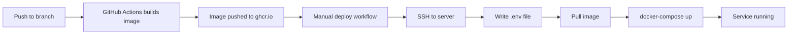
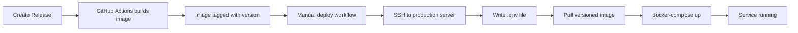

# Docker & Deployment

This guide covers building Docker images, running AtlasML with Docker Compose, and deploying to production environments.

---

## Dockerfile Breakdown

**Location**: `/atlas/AtlasMl/Dockerfile`

### Multi-Stage Build

AtlasML uses a **two-stage Docker build** for optimization:

```dockerfile
# Stage 1: Builder
FROM python:3.13-slim AS builder

# Stage 2: Runtime
FROM python:3.13-slim AS runtime
```

**Benefits**:
- Smaller final image (no build tools)
- Faster deployment
- Improved security (fewer packages)

---

### Stage 1: Builder

```dockerfile
FROM python:3.13-slim AS builder

# Install build dependencies
RUN apt-get update && apt-get install -y --no-install-recommends  \
    build-essential \
    && rm -rf /var/lib/apt/lists/*

# Install Poetry
RUN pip install poetry

# Ensure venv is created in project directory
ENV POETRY_VIRTUALENVS_IN_PROJECT=true

WORKDIR /atlasml

# Copy dependency files
COPY pyproject.toml poetry.lock README.md  ./
COPY atlasml/ ./atlasml/

# Install dependencies (including dev for uvicorn)
RUN poetry install --with dev
```

**What happens here**:
1. Install build tools (gcc, etc.)
2. Install Poetry
3. Configure Poetry to create `.venv` in project
4. Copy source code
5. Install all dependencies into `.venv`

**Why `--with dev`?**
- Includes uvicorn for running the app
- Dev dependencies needed in production for AtlasML

---

### Stage 2: Runtime

```dockerfile
FROM python:3.13-slim AS runtime

WORKDIR /atlasml

# Install runtime dependencies
RUN apt-get update && apt-get install -y --no-install-recommends  \
    build-essential \
    && rm -rf /var/lib/apt/lists/*

# Copy only the venv and source code from builder
COPY --from=builder /atlasml/.venv /atlasml/.venv
COPY --from=builder /atlasml/atlasml /atlasml/atlasml

# Set environment to use the venv
ENV VIRTUAL_ENV=/atlasml/.venv
ENV PATH="/atlasml/.venv/bin:$PATH"

# Expose port
EXPOSE 8000

# Run application
CMD ["/atlasml/.venv/bin/python", "-m", "uvicorn", "atlasml.app:app", "--host", "0.0.0.0", "--port", "8000"]
```

**What happens here**:
1. Start with clean Python 3.13 base
2. Install minimal runtime dependencies
3. Copy virtual environment from builder
4. Copy application code from builder
5. Configure PATH to use venv
6. Expose port 8000
7. Run uvicorn

**Result**: Image contains only runtime essentials (~500MB vs ~1.5GB with build tools)

---

## Building the Docker Image

### Local Build

```bash
cd /path/to/edutelligence/atlas/AtlasMl

# Build image
docker build -t atlasml:latest .

# Check image size
docker images atlasml:latest
```

**Output**:
```
REPOSITORY   TAG       SIZE
atlasml      latest    523MB
```

### Build with Tag

```bash
docker build -t atlasml:v1.0.0 -t atlasml:latest .
```

### Build for Different Platforms

```bash
# For ARM (Apple Silicon)
docker buildx build --platform linux/arm64 -t atlasml:latest .

# For AMD (Intel/AMD)
docker buildx build --platform linux/amd64 -t atlasml:latest .

# For both
docker buildx build --platform linux/amd64,linux/arm64 -t atlasml:latest .
```

---

## Running with Docker

### Run Standalone Container

```bash
docker run -d \
  --name atlasml \
  -p 8000:8000 \
  -e WEAVIATE_HOST=host.docker.internal \
  -e WEAVIATE_PORT=8085 \
  -e WEAVIATE_GRPC_PORT=50051 \
  -e ATLAS_API_KEYS='["test-key"]' \
  -e OPENAI_API_KEY=your-key \
  -e OPENAI_API_URL=your-url \
  -e ENV=production \
  atlasml:latest
```

**Flags**:
- `-d`: Run in background (detached)
- `--name`: Container name
- `-p 8000:8000`: Port mapping (host:container)
- `-e`: Environment variables

### Using .env File

```bash
docker run -d \
  --name atlasml \
  -p 8000:8000 \
  --env-file .env \
  atlasml:latest
```

### View Logs

```bash
# Follow logs
docker logs -f atlasml

# Last 100 lines
docker logs --tail 100 atlasml

# Since 10 minutes ago
docker logs --since 10m atlasml
```

### Stop and Remove

```bash
# Stop container
docker stop atlasml

# Remove container
docker rm atlasml

# Stop and remove in one command
docker rm -f atlasml
```

---

## Docker Compose

**Location**: `/atlas/compose.atlas.yaml`

### Compose File Breakdown

```yaml
services:
  atlasml:
    image: 'ghcr.io/ls1intum/edutelligence/atlasml:${IMAGE_TAG}'
    env_file:
      - .env
    environment:
      PYTHONPATH: ${PYTHONPATH:-/atlasml}
      WEAVIATE_HOST: ${WEAVIATE_HOST:-http://weaviate-test.ase.cit.tum.de/}
      WEAVIATE_PORT: ${WEAVIATE_PORT:-80}
      WEAVIATE_GRPC_PORT: ${WEAVIATE_GRPC_PORT:-443}
      OPENAI_API_KEY: ${OPENAI_API_KEY}
      OPENAI_API_URL: ${OPENAI_API_URL:-https://ase-se01.openai.azure.com}
      ATLAS_API_KEYS: ${ATLAS_API_KEYS:-["SuperSecureKey"]}
      SENTRY_DSN: ${SENTRY_DSN:-https://...@sentry.../6}
      ENV: ${ENV:-production}
    restart: unless-stopped
    ports:
      - '80:8000'
    networks:
      - shared-network
    healthcheck:
      test: ['CMD', 'curl', '-f', 'http://localhost:8000/api/v1/health']
      interval: 5s
      timeout: 10s
      retries: 10
      start_period: 5s
    logging:
      driver: 'json-file'
      options:
        max-size: '50m'
        max-file: '5'

networks:
  shared-network:
    name: shared-network
    driver: bridge
```

### Key Sections

#### 1. Image

```yaml
image: 'ghcr.io/ls1intum/edutelligence/atlasml:${IMAGE_TAG}'
```

Uses image from GitHub Container Registry. `IMAGE_TAG` is set via environment.

#### 2. Environment Variables

```yaml
env_file:
  - .env
environment:
  WEAVIATE_HOST: ${WEAVIATE_HOST:-http://...}
```

- `env_file`: Load from `.env` file
- `environment`: Override or set specific variables
- `${VAR:-default}`: Use `VAR` if set, otherwise use `default`

#### 3. Restart Policy

```yaml
restart: unless-stopped
```

**Options**:
- `no`: Never restart
- `always`: Always restart
- `on-failure`: Restart only if exit code != 0
- `unless-stopped`: Restart unless manually stopped

#### 4. Port Mapping

```yaml
ports:
  - '80:8000'
```

Maps host port 80 to container port 8000.

#### 5. Health Check

```yaml
healthcheck:
  test: ['CMD', 'curl', '-f', 'http://localhost:8000/api/v1/health']
  interval: 5s
  timeout: 10s
  retries: 10
  start_period: 5s
```

**Parameters**:
- `test`: Command to run (curl health endpoint)
- `interval`: Check every 5 seconds
- `timeout`: Max 10 seconds per check
- `retries`: Try 10 times before marking unhealthy
- `start_period`: Grace period before checking

**Status**:
```bash
docker ps
# Look for (healthy) or (unhealthy) in STATUS column
```

#### 6. Logging

```yaml
logging:
  driver: 'json-file'
  options:
    max-size: '50m'
    max-file: '5'
```

**Log rotation**:
- Max 50MB per log file
- Keep 5 files
- Total max: 250MB logs

#### 7. Networks

```yaml
networks:
  shared-network:
    name: shared-network
    driver: bridge
```

Connects to shared network for communication with other services (e.g., Weaviate).

---

### Running with Docker Compose

#### Start Services

```bash
cd /path/to/edutelligence/atlas

# Start in background
docker compose -f compose.atlas.yaml up -d

# Start with specific tag
IMAGE_TAG=v1.0.0 docker compose -f compose.atlas.yaml up -d
```

#### View Logs

```bash
# All services
docker compose -f compose.atlas.yaml logs -f

# Specific service
docker compose -f compose.atlas.yaml logs -f atlasml
```

#### Stop Services

```bash
# Stop (keeps containers)
docker compose -f compose.atlas.yaml stop

# Stop and remove
docker compose -f compose.atlas.yaml down

# Stop, remove, and delete volumes
docker compose -f compose.atlas.yaml down -v
```

#### Restart Service

```bash
docker compose -f compose.atlas.yaml restart atlasml
```

#### Check Status

```bash
docker compose -f compose.atlas.yaml ps
```

---

## Environment Variables

### Required Variables

```bash
# API Authentication
ATLAS_API_KEYS='["key1","key2"]'

# Weaviate Connection
WEAVIATE_HOST=localhost
WEAVIATE_PORT=8085
WEAVIATE_GRPC_PORT=50051

# OpenAI (or leave empty for local models)
OPENAI_API_KEY=your-key
OPENAI_API_URL=https://your-resource.openai.azure.com
```

### Optional Variables

```bash
# Sentry Error Tracking
SENTRY_DSN=https://...@sentry.../6

# Environment Name
ENV=production  # or development, staging

# Python Path (usually default is fine)
PYTHONPATH=/atlasml
```

### Setting in Production

**Option 1: .env File**
```bash
# Create /opt/atlasml/.env
cat > /opt/atlasml/.env << 'EOF'
ATLAS_API_KEYS='["prod-key-1","prod-key-2"]'
WEAVIATE_HOST=weaviate.internal
...
EOF
```

**Option 2: Docker Secrets**
```bash
# Create secrets
echo "my-api-key" | docker secret create atlas_api_key -

# Use in compose
secrets:
  atlas_api_key:
    external: true
```

**Option 3: Environment Variables**
```bash
export ATLAS_API_KEYS='["key1"]'
docker compose up -d
```

---

## GitHub Actions Workflows

### 1. Build and Push Docker Image

**File**: `.github/workflows/atlas_build-and-push-docker.yml`

```yaml
name: AtlasML - Build Docker Images

on:
  push:
    paths:
      - 'atlas/**'
      - '.github/workflows/atlas_build-and-push-docker.yml'
  release:
    types:
      - created

jobs:
  build:
    name: AtlasML
    if: github.actor != 'dependabot[bot]'
    uses: ls1intum/.github/.github/workflows/build-and-push-docker-image.yml@feat/minor-build-improvements
    with:
      image-name: ghcr.io/ls1intum/edutelligence/atlasml
      docker-file: ./atlas/AtlasMl/Dockerfile
      docker-context: ./atlas/AtlasMl
```

**Triggers**:
- Push to paths matching `atlas/**`
- New release created

**What it does**:
1. Builds Docker image
2. Tags with branch name or release version
3. Pushes to GitHub Container Registry (`ghcr.io`)

**Resulting Images**:
- `ghcr.io/ls1intum/edutelligence/atlasml:main`
- `ghcr.io/ls1intum/edutelligence/atlasml:v1.0.0`
- `ghcr.io/ls1intum/edutelligence/atlasml:pr-123`

---

### 2. Deploy to Test Environment

**File**: `.github/workflows/atlas_deploy-test.yml`

```yaml
name: AtlasML - Deploy to Test 1

on:
  workflow_dispatch:
    inputs:
      image-tag:
        type: string
        description: 'Image tag to deploy'
      deploy-atlasml:
        type: boolean
        default: true
        description: (Re-)deploys AtlasML.

jobs:
  provision-env:
    runs-on: ubuntu-latest
    environment: 'Atlas - Test 1'
    steps:
      - name: Write .env to remote host
        uses: appleboy/ssh-action@v1.0.3
        with:
          host: ${{ secrets.SSH_HOST }}
          username: ${{ secrets.SSH_USERNAME }}
          key: ${{ secrets.SSH_PRIVATE_KEY }}
          script: |
            sudo mkdir -p /opt/atlasml
            cat << EOF | sudo tee /opt/atlasml/.env > /dev/null
            PYTHONPATH='${{ secrets.PYTHONPATH }}'
            WEAVIATE_HOST='${{ secrets.WEAVIATE_HOST }}'
            ...
            EOF
            sudo chmod 600 /opt/atlasml/.env

  deploy-atlasml:
    needs: provision-env
    if: ${{ inputs.deploy-atlasml }}
    uses: ls1intum/.github/.github/workflows/deploy-docker-compose.yml@main
    with:
      environment: 'AtlasML - Test 1'
      docker-compose-file: './atlas/compose.atlas.yaml'
      main-image-name: ls1intum/edutelligence/atlasml
      image-tag: ${{ inputs.image-tag }}
      deployment-base-path: '/opt/atlasml'
    secrets: inherit
```

**Trigger**: Manual (workflow_dispatch)

**Steps**:
1. **Provision**: Write `.env` file to remote server via SSH
2. **Deploy**: Pull image and restart with docker-compose

**Usage**:
1. Go to GitHub Actions
2. Select "AtlasML - Deploy to Test 1"
3. Click "Run workflow"
4. Enter image tag (e.g., `main`, `v1.0.0`)
5. Click "Run workflow"

---

## Deployment Process

### Development

```bash
# Local development (no Docker)
poetry run uvicorn atlasml.app:app --reload
```

### Staging/Test



**Steps**:
1. Push code to branch
2. GitHub Actions builds image with branch tag
3. Go to GitHub Actions → "Deploy to Test 1"
4. Enter image tag (branch name or `pr-123`)
5. Workflow SSHs to server and deploys

### Production



**Steps**:
1. Create GitHub release (e.g., `v1.2.0`)
2. GitHub Actions builds and tags image `v1.2.0`
3. Run deploy workflow with tag `v1.2.0`
4. Service updated in production

---

## Monitoring & Logging

### View Container Logs

```bash
# Real-time logs
docker logs -f atlasml

# With timestamps
docker logs -f --timestamps atlasml

# Last 100 lines
docker logs --tail 100 atlasml
```

### Container Stats

```bash
# Real-time stats
docker stats atlasml

# Output:
# CONTAINER  CPU %  MEM USAGE / LIMIT    MEM %  NET I/O      BLOCK I/O
# atlasml    2.5%   256MB / 2GB          12.8%  1.2MB/500KB  10MB/5MB
```

### Health Status

```bash
docker ps --filter name=atlasml
# Look for (healthy) in STATUS column
```

### Inspect Container

```bash
docker inspect atlasml
# Returns JSON with full container config
```

---

## Troubleshooting

### Container Won't Start

**Check logs**:
```bash
docker logs atlasml
```

**Common issues**:
- Missing environment variables
- Weaviate connection failure
- Port already in use

**Solution**:
```bash
# Check env vars
docker exec atlasml env | grep WEAVIATE

# Test Weaviate connection
docker exec atlasml curl http://weaviate:8080/v1/.well-known/ready
```

### Health Check Failing

**Check health status**:
```bash
docker inspect atlasml | grep -A 10 Health
```

**Test health endpoint manually**:
```bash
docker exec atlasml curl http://localhost:8000/api/v1/health
```

### Out of Memory

**Increase memory limit**:
```yaml
services:
  atlasml:
    deploy:
      resources:
        limits:
          memory: 2G
```

### Slow Performance

**Check CPU/memory usage**:
```bash
docker stats atlasml
```

**Optimize**:
- Increase container resources
- Use async operations
- Cache frequent queries
- Scale horizontally

---

## Best Practices

### 1. Use Specific Image Tags

```yaml
# ✅ Good - Specific version
image: ghcr.io/ls1intum/edutelligence/atlasml:v1.2.0

# ❌ Bad - Latest (unpredictable)
image: ghcr.io/ls1intum/edutelligence/atlasml:latest
```

### 2. Set Resource Limits

```yaml
services:
  atlasml:
    deploy:
      resources:
        limits:
          cpus: '2.0'
          memory: 2G
        reservations:
          cpus: '1.0'
          memory: 512M
```

### 3. Configure Logging

```yaml
logging:
  driver: json-file
  options:
    max-size: 50m
    max-file: 5
```

### 4. Use Health Checks

```yaml
healthcheck:
  test: curl -f http://localhost:8000/api/v1/health || exit 1
  interval: 30s
  timeout: 10s
  retries: 3
```

### 5. Secure Secrets

```bash
# ✅ Good - Use secrets or vault
docker secret create atlas_key /path/to/key

# ❌ Bad - Hardcode in compose file
environment:
  ATLAS_API_KEYS: '["hardcoded-key"]'
```

### 6. Use Named Volumes

```yaml
volumes:
  - atlasml-data:/data
```

### 7. Network Isolation

```yaml
networks:
  internal:
    internal: true  # No external access
  public:
    # Exposed to internet
```

---

## Next Steps

- **[Troubleshooting](./troubleshooting.md)**: Debug deployment issues
- **[Development Workflow](./development-workflow.md)**: Build and test locally
- **[Architecture](./architecture.md)**: Understand the system
- **[Testing](./testing.md)**: Test before deploying

---

## Resources

- **Docker Documentation**: https://docs.docker.com/
- **Docker Compose**: https://docs.docker.com/compose/
- **GitHub Actions**: https://docs.github.com/en/actions
- **GHCR**: https://docs.github.com/en/packages/working-with-a-github-packages-registry/working-with-the-container-registry
