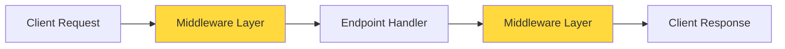
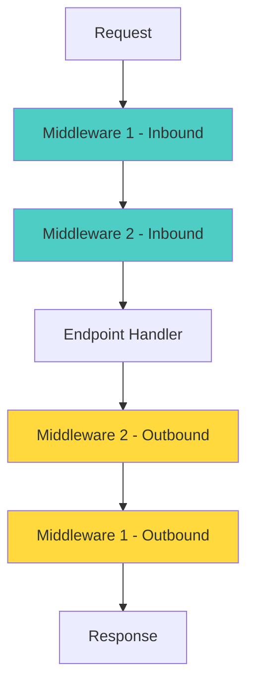

# Middleware Documentation

Middleware in AtlasML intercepts every request and response, enabling logging, authentication, error handling, and other cross-cutting concerns. This guide explains how middleware works and how to use it effectively.

---

## What is Middleware?

**Middleware** is code that runs before and after every API request. It wraps your endpoint handlers, allowing you to:

- Log requests and responses
- Modify requests/responses
- Add headers
- Handle errors
- Measure performance
- Authenticate users
- Rate limit requests

### Middleware Flow



Middleware executes **twice**:
1. **Before** the endpoint handler (inbound)
2. **After** the endpoint handler (outbound)

---

## RequestLoggingMiddleware

AtlasML's primary middleware logs all requests and responses for debugging and monitoring.

### Location

**File**: `atlasml/app.py`

### Implementation

```python
import time
from fastapi import Request
from starlette.middleware.base import BaseHTTPMiddleware

class RequestLoggingMiddleware(BaseHTTPMiddleware):
    async def dispatch(self, request: Request, call_next):
        start_time = time.time()

        # --- INBOUND: Before endpoint handler ---
        logger.info(f"→ {request.method} {request.url.path}")

        # Log POST request bodies
        if request.method == "POST":
            body = await request.body()
            logger.info(f"📦 Request body: {body.decode()[:200]}")

        # --- CALL ENDPOINT HANDLER ---
        response = await call_next(request)

        # --- OUTBOUND: After endpoint handler ---
        duration = time.time() - start_time
        logger.info(f"← {response.status_code} ({duration:.3f}s)")

        return response
```

### What It Logs

#### 1. Request Method and Path
```
INFO → POST /api/v1/competency/suggest
```

#### 2. Request Body (POST only, first 200 chars)
```
INFO 📦 Request body: {"description":"Python programming","course_id":1}
```

#### 3. Response Status and Duration
```
INFO ← 200 (0.234s)
```

### Example Log Output

```
INFO → POST /api/v1/competency/suggest
INFO 📦 Request body: {"description":"Understanding of OOP","course_id":1}
INFO ← 200 (0.456s)

INFO → GET /api/v1/health/
INFO ← 200 (0.002s)

INFO → POST /api/v1/competency/save
INFO 📦 Request body: {"competencies":[{"id":100,"title":"ML Basics",...}],"operation_type":"UPDATE"}
INFO ← 200 (1.234s)
```

---

## How Middleware Works

### Execution Order

When multiple middleware are registered, they execute in **reverse order** on the way out:



**Example**:
```python
app.add_middleware(CORSMiddleware)          # Executes 2nd (in), 2nd (out)
app.add_middleware(RequestLoggingMiddleware) # Executes 1st (in), 3rd (out)
```

### Middleware Registration

In `atlasml/app.py`:

```python
# Create FastAPI app
app = FastAPI(title="AtlasML API", lifespan=lifespan)

# Add middleware
app.add_middleware(RequestLoggingMiddleware)
```

:::tip
Middleware registered **last** executes **first** on the inbound path.
:::

---

## Use Cases

### 1. Request Logging (Current)

**Purpose**: Debug API activity, monitor performance, audit trails.

**What it logs**:
- All HTTP requests (method, path)
- POST bodies for debugging
- Response status codes
- Processing time

**When it's useful**:
- Debugging failed requests
- Identifying slow endpoints
- Understanding API usage patterns
- Troubleshooting issues

### 2. Authentication (Via Dependencies)

AtlasML uses **dependency injection** for authentication instead of middleware:

```python
@router.post("/suggest", dependencies=[Depends(TokenValidator)])
async def suggest_competencies(request: SuggestCompetencyRequest):
    # Only runs if authenticated
```

**Why not middleware?**
- More flexible (per-endpoint control)
- Better for optional auth
- Clearer in code

### 3. CORS (Cross-Origin Resource Sharing)

If AtlasML needs to be accessed from browsers:

```python
from fastapi.middleware.cors import CORSMiddleware

app.add_middleware(
    CORSMiddleware,
    allow_origins=["https://frontend.example.com"],
    allow_credentials=True,
    allow_methods=["*"],
    allow_headers=["*"],
)
```

### 4. Request ID Tracking

Add unique IDs to trace requests through logs:

```python
import uuid
from starlette.middleware.base import BaseHTTPMiddleware

class RequestIDMiddleware(BaseHTTPMiddleware):
    async def dispatch(self, request: Request, call_next):
        request_id = str(uuid.uuid4())
        request.state.request_id = request_id

        response = await call_next(request)
        response.headers["X-Request-ID"] = request_id
        return response
```

---

## Modifying Requests

Middleware can modify the request before it reaches the handler:

```python
class AddCustomHeaderMiddleware(BaseHTTPMiddleware):
    async def dispatch(self, request: Request, call_next):
        # Add custom header
        request.headers.__dict__["_list"].append(
            (b"x-custom-header", b"custom-value")
        )

        response = await call_next(request)
        return response
```

:::warning
Modifying request headers can be tricky. Consider using `request.state` instead:

```python
request.state.custom_data = "value"
```
:::

---

## Modifying Responses

Middleware can modify the response after the handler:

```python
class AddResponseHeaderMiddleware(BaseHTTPMiddleware):
    async def dispatch(self, request: Request, call_next):
        response = await call_next(request)

        # Add custom response header
        response.headers["X-Powered-By"] = "AtlasML"
        response.headers["X-Version"] = "1.0.0"

        return response
```

---

## Error Handling in Middleware

Middleware can catch and handle exceptions:

```python
class ErrorHandlingMiddleware(BaseHTTPMiddleware):
    async def dispatch(self, request: Request, call_next):
        try:
            response = await call_next(request)
            return response
        except Exception as e:
            logger.error(f"Unhandled exception: {e}")
            return JSONResponse(
                status_code=500,
                content={"detail": "Internal server error"}
            )
```

:::note
FastAPI has built-in exception handlers that are usually sufficient. Use middleware exception handling only for cross-cutting concerns.
:::

---

## Performance Monitoring

Use middleware to track performance metrics:

```python
import time
from prometheus_client import Histogram

request_duration = Histogram(
    'http_request_duration_seconds',
    'HTTP request duration',
    ['method', 'endpoint', 'status']
)

class MetricsMiddleware(BaseHTTPMiddleware):
    async def dispatch(self, request: Request, call_next):
        start_time = time.time()

        response = await call_next(request)

        duration = time.time() - start_time
        request_duration.labels(
            method=request.method,
            endpoint=request.url.path,
            status=response.status_code
        ).observe(duration)

        return response
```

---

## Creating Custom Middleware

### Step 1: Create Middleware Class

```python
from starlette.middleware.base import BaseHTTPMiddleware
from fastapi import Request

class CustomMiddleware(BaseHTTPMiddleware):
    async def dispatch(self, request: Request, call_next):
        # Code before endpoint handler
        print(f"Before: {request.url.path}")

        # Call the endpoint
        response = await call_next(request)

        # Code after endpoint handler
        print(f"After: {response.status_code}")

        return response
```

### Step 2: Register Middleware

In `atlasml/app.py`:

```python
from atlasml.middleware import CustomMiddleware

app.add_middleware(CustomMiddleware)
```

### Step 3: Test Middleware

```python
from fastapi.testclient import TestClient

def test_custom_middleware():
    client = TestClient(app)
    response = client.get("/api/v1/health/")
    assert response.status_code == 200
```

---

## Middleware Best Practices

### 1. Keep Middleware Fast

Middleware runs on **every request**. Avoid:
- Heavy computations
- Synchronous database calls
- Blocking operations

```python
# ❌ Bad - Slow
class SlowMiddleware(BaseHTTPMiddleware):
    async def dispatch(self, request: Request, call_next):
        time.sleep(1)  # Blocks all requests!
        return await call_next(request)

# ✅ Good - Fast
class FastMiddleware(BaseHTTPMiddleware):
    async def dispatch(self, request: Request, call_next):
        await some_async_operation()  # Non-blocking
        return await call_next(request)
```

### 2. Order Matters

Place middleware in the correct order:

```python
# Correct order
app.add_middleware(ErrorHandlingMiddleware)   # Catches all errors
app.add_middleware(RequestLoggingMiddleware)  # Logs requests/responses
app.add_middleware(AuthenticationMiddleware)  # Checks auth
```

### 3. Use Dependencies for Per-Endpoint Logic

For logic that only applies to specific endpoints, use **dependencies** instead of middleware:

```python
# ❌ Bad - Middleware for specific logic
class CompetencyMiddleware(BaseHTTPMiddleware):
    async def dispatch(self, request: Request, call_next):
        if "/competency/" in request.url.path:
            # Special logic
            ...
        return await call_next(request)

# ✅ Good - Dependency
@router.post("/suggest", dependencies=[Depends(validate_course)])
async def suggest_competencies(...):
    ...
```

### 4. Don't Read Request Body Twice

If middleware reads the body, it needs to be restored:

```python
class BodyLoggingMiddleware(BaseHTTPMiddleware):
    async def dispatch(self, request: Request, call_next):
        # Read body
        body = await request.body()
        logger.info(f"Body: {body.decode()}")

        # Restore body for endpoint to read
        async def receive():
            return {"type": "http.request", "body": body}

        request._receive = receive

        return await call_next(request)
```

:::tip
RequestLoggingMiddleware already handles this correctly!
:::

### 5. Handle Exceptions Gracefully

```python
class SafeMiddleware(BaseHTTPMiddleware):
    async def dispatch(self, request: Request, call_next):
        try:
            response = await call_next(request)
            return response
        except Exception as e:
            logger.exception("Middleware error")
            # Re-raise to let FastAPI handle it
            raise
```

---

## Debugging Middleware

### Enable Debug Logging

Set log level to DEBUG:

```python
import logging

logging.basicConfig(level=logging.DEBUG)
```

### Add Debug Prints

```python
class DebugMiddleware(BaseHTTPMiddleware):
    async def dispatch(self, request: Request, call_next):
        print(f"[DEBUG] Request: {request.method} {request.url}")
        print(f"[DEBUG] Headers: {request.headers}")

        response = await call_next(request)

        print(f"[DEBUG] Response: {response.status_code}")
        print(f"[DEBUG] Response headers: {response.headers}")

        return response
```

### Check Middleware Order

```python
# In app.py, print registered middleware
print("Registered middleware:")
for middleware in app.user_middleware:
    print(f"  - {middleware}")
```

---

## Disabling Middleware

### For Testing

Remove middleware in test fixtures:

```python
import pytest
from fastapi.testclient import TestClient
from atlasml.app import app

@pytest.fixture
def client_without_logging():
    # Remove logging middleware for clean test output
    app.user_middleware = [
        m for m in app.user_middleware
        if not isinstance(m.cls, RequestLoggingMiddleware)
    ]
    return TestClient(app)
```

### Conditional Registration

Only add middleware in production:

```python
from atlasml.config import get_settings

if get_settings().env == "production":
    app.add_middleware(RequestLoggingMiddleware)
```

---

## Common Middleware Patterns

### 1. Request/Response Logging
**Current implementation** - Logs all API activity

### 2. Authentication
**Use FastAPI dependencies instead** - More flexible

### 3. CORS
**Add if needed** for browser access

### 4. Request ID
**Useful for tracing** requests through logs

### 5. Rate Limiting
**Add for production** to prevent abuse

### 6. Compression
**Compress responses** to reduce bandwidth

```python
from fastapi.middleware.gzip import GZipMiddleware

app.add_middleware(GZipMiddleware, minimum_size=1000)
```

### 7. Trusted Hosts
**Validate Host header** to prevent host header attacks

```python
from fastapi.middleware.trustedhosts import TrustedHostMiddleware

app.add_middleware(
    TrustedHostMiddleware,
    allowed_hosts=["atlasml.example.com", "*.example.com"]
)
```

---

## Next Steps

- **[Architecture](./architecture.md)**: Understand where middleware fits
- **[REST API Framework](./rest-api.md)**: Learn about FastAPI patterns
- **[Development Workflow](./development-workflow.md)**: Add custom middleware
- **[Testing Guide](./testing.md)**: Test middleware behavior

---

## Resources

- **FastAPI Middleware**: https://fastapi.tiangolo.com/tutorial/middleware/
- **Starlette Middleware**: https://www.starlette.io/middleware/
- **ASGI Middleware**: https://asgi.readthedocs.io/en/latest/specs/main.html
