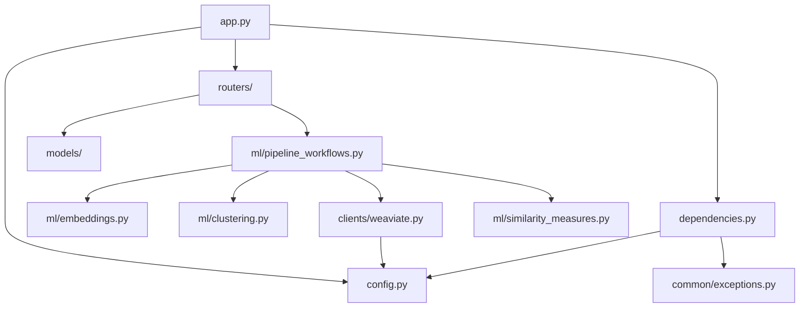

# AtlasML Module Reference

This comprehensive guide documents every module in the AtlasML codebase. Use this as a reference when reading code, adding features, or debugging issues.

---

## Module Organization

```
atlasml/
├── app.py                          # Application entry point
├── config.py                       # Configuration management
├── dependencies.py                 # FastAPI dependencies (auth)
├── utils.py                        # Utility functions
├── clients/
│   └── weaviate.py                 # Weaviate database client
├── routers/
│   ├── health.py                   # Health check endpoint
│   └── competency.py               # Competency endpoints
├── models/
│   └── competency.py               # Pydantic data models
├── ml/
│   ├── embeddings.py               # Embedding generation
│   ├── clustering.py               # Clustering algorithms
│   ├── similarity_measures.py      # Similarity computations
│   ├── centroid_similarity.py      # Centroid calculations
│   ├── pipeline_workflows.py       # ML workflow orchestration
│   ├── generate_competency_relationship.py  # Relationship generation
│   └── feedback_loop.py            # Feedback mechanisms
└── common/
    └── exceptions.py               # Custom exceptions
```

---

## Core Application Modules

### `app.py` - Application Entry Point

**Purpose**: Creates and configures the FastAPI application, registers middleware, routers, and manages lifecycle events.

**Key Components**:

#### `RequestLoggingMiddleware`
```python
class RequestLoggingMiddleware(BaseHTTPMiddleware):
    async def dispatch(self, request: Request, call_next):
        # Logs request/response details
```

Logs every request with:
- HTTP method and path
- Request body (for POST requests)
- Response status code
- Processing duration

#### `lifespan(app)`
```python
@asynccontextmanager
async def lifespan(app):
    # Startup: Initialize Weaviate, log status
    yield
    # Shutdown: Close connections
```

Manages application lifecycle:
- **Startup**: Initialize Weaviate client, verify connection
- **Shutdown**: Close Weaviate connection gracefully

#### `validation_exception_handler`
```python
@app.exception_handler(RequestValidationError)
async def validation_exception_handler(request, exc):
    # Returns 422 with detailed validation errors
```

Handles Pydantic validation errors with detailed debugging info.

**When to Modify**:
- Adding global middleware
- Registering new routers
- Adding startup/shutdown tasks
- Custom exception handlers

**File**: `atlasml/app.py`

---

### `config.py` - Configuration Management

**Purpose**: Loads and validates configuration from environment variables using Pydantic.

**Key Classes**:

#### `APIKeyConfig`
```python
class APIKeyConfig(BaseModel):
    token: str
```

Single API key definition.

#### `WeaviateSettings`
```python
class WeaviateSettings(BaseModel):
    host: str          # e.g., "localhost"
    port: int          # e.g., 8085
    grpc_port: int     # e.g., 50051
```

Weaviate connection parameters.

#### `Settings`
```python
class Settings(BaseModel):
    api_keys: list[APIKeyConfig]    # API keys for auth
    weaviate: WeaviateSettings      # Weaviate config
    sentry_dsn: str | None = None   # Optional Sentry DSN
    env: str = "development"        # Environment name

    @classmethod
    def get_settings(cls, use_defaults: bool = False):
        # Load from env or return defaults
```

Main settings container.

**Key Functions**:

```python
def get_settings(use_defaults: bool = False) -> Settings:
    # Returns singleton Settings instance
```

**Environment Variables**:
- `ATLAS_API_KEYS`: JSON array of API keys
- `WEAVIATE_HOST`, `WEAVIATE_PORT`, `WEAVIATE_GRPC_PORT`
- `SENTRY_DSN`, `ENV`

**When to Modify**:
- Adding new configuration options
- Changing environment variable names
- Adding validation logic

**File**: `atlasml/config.py`

---

### `dependencies.py` - Authentication Dependencies

**Purpose**: Provides FastAPI dependencies for API key authentication.

**Key Components**:

#### `_get_api_key(request)`
```python
def _get_api_key(request: Request) -> str:
    # Extracts Authorization header
    # Raises 401 if missing
```

#### `TokenValidator`
```python
class TokenValidator:
    def __init__(self, api_keys: List[APIKeyConfig] = Depends(get_api_keys)):
        self.api_keys = api_keys

    async def __call__(self, api_key: str = Depends(_get_api_key)) -> APIKeyConfig:
        # Validates API key
        # Returns APIKeyConfig if valid
        # Raises HTTPException(401) if invalid
```

Callable class for dependency injection.

#### `validate_token(api_key, api_keys)`
```python
def validate_token(
    api_key: str = Depends(_get_api_key),
    api_keys: List[APIKeyConfig] = Depends(get_api_keys),
) -> APIKeyConfig:
    # Functional alternative to TokenValidator
```

**Usage Example**:
```python
@router.post("/suggest", dependencies=[Depends(TokenValidator)])
async def suggest_competencies(request: SuggestCompetencyRequest):
    # Requires valid API key
```

**When to Modify**:
- Changing authentication mechanism
- Adding additional auth methods (JWT, OAuth)
- Custom authorization logic

**File**: `atlasml/dependencies.py`

---

## Router Modules

### `routers/health.py` - Health Check

**Purpose**: Provides a simple liveness/readiness endpoint for container orchestrators.

**Endpoints**:

```python
@router.get("/")
async def health():
    return []
```

- **Path**: `/api/v1/health/`
- **Method**: GET
- **Authentication**: None
- **Response**: `[]` (200 OK)

**Use Cases**:
- Docker healthchecks
- Kubernetes liveness probes
- Load balancer health checks

**When to Modify**:
- Adding detailed health status (database, external APIs)
- Changing response format

**File**: `atlasml/routers/health.py`

---

### `routers/competency.py` - Competency Operations

**Purpose**: Handles all competency-related API endpoints.

**Endpoints**:

#### 1. `POST /suggest`
```python
async def suggest_competencies(
    request: SuggestCompetencyRequest,
) -> SuggestCompetencyResponse:
    # Suggests competencies based on description
```

**Flow**:
1. Generate embedding for description
2. Search Weaviate for similar competencies in course
3. Rank by similarity
4. Return top suggestions

#### 2. `POST /save`
```python
async def save_competencies(request: SaveCompetencyRequest):
    # Saves or deletes competencies/exercises
```

**Flow**:
1. Parse operation type (UPDATE/DELETE)
2. For UPDATE: Generate embeddings, store in Weaviate
3. For DELETE: Remove from Weaviate
4. Return success

#### 3. `GET /relations/suggest/{course_id}`
```python
async def suggest_competency_relations(course_id: int) -> CompetencyRelationSuggestionResponse:
    # Generates relationship suggestions
```

**Flow**:
1. Fetch all competencies for course
2. Analyze semantic relationships
3. Generate candidate relations (MATCHES, EXTENDS, REQUIRES)
4. Return relation graph

**When to Modify**:
- Adding new competency endpoints
- Changing suggestion algorithms
- Modifying response formats

**File**: `atlasml/routers/competency.py`

---

## Data Model Modules

### `models/competency.py` - Pydantic Models

**Purpose**: Defines API contracts and domain models using Pydantic.

**Core Types**:

#### `OperationType`
```python
class OperationType(str, Enum):
    UPDATE = "UPDATE"
    DELETE = "DELETE"
```

#### `Competency`
```python
class Competency(BaseModel):
    id: int
    title: str
    description: Optional[str]
    course_id: int
```

#### `ExerciseWithCompetencies`
```python
class ExerciseWithCompetencies(BaseModel):
    id: int
    title: str
    description: str
    competencies: Optional[list[int]]
    course_id: int
```

#### `SemanticCluster`
```python
class SemanticCluster(BaseModel):
    cluster_id: str
    course_id: int
    vector_embedding: list[float]
```

**Request/Response Models**:

#### `SuggestCompetencyRequest`
```python
class SuggestCompetencyRequest(BaseModel):
    description: str
    course_id: int
```

#### `SuggestCompetencyResponse`
```python
class SuggestCompetencyResponse(BaseModel):
    competencies: list[Competency]
```

#### `SaveCompetencyRequest`
```python
class SaveCompetencyRequest(BaseModel):
    competencies: Optional[list[Competency]]
    exercise: Optional[ExerciseWithCompetencies]
    operation_type: OperationType
```

#### `RelationType`
```python
class RelationType(str, Enum):
    MATCHES = "MATCHES"       # Similar content
    EXTENDS = "EXTENDS"       # Builds upon
    REQUIRES = "REQUIRES"     # Prerequisite
```

#### `CompetencyRelation`
```python
class CompetencyRelation(BaseModel):
    tail_id: int              # Source competency
    head_id: int              # Target competency
    relation_type: RelationType
```

#### `CompetencyRelationSuggestionResponse`
```python
class CompetencyRelationSuggestionResponse(BaseModel):
    relations: list[CompetencyRelation]
```

**When to Modify**:
- Adding new API endpoints (new request/response models)
- Changing data structures
- Adding validation rules

**File**: `atlasml/models/competency.py`

---

## Client Modules

### `clients/weaviate.py` - Weaviate Database Client

**Purpose**: Provides a high-level interface to Weaviate vector database with schema management and CRUD operations.

**Key Classes**:

#### `CollectionNames`
```python
class CollectionNames(str, Enum):
    EXERCISE = "Exercise"
    COMPETENCY = "Competency"
    SEMANTIC_CLUSTER = "SemanticCluster"
```

Defines available collections.

#### `WeaviateClient`
```python
class WeaviateClient:
    def __init__(self, weaviate_settings: WeaviateSettings = None):
        # Initialize connection
        # Ensure collections exist
```

Main client class with methods:

**CRUD Operations**:

```python
def add_embeddings(
    self,
    collection_name: str,
    embeddings: list[float],
    properties: dict | None = None,
) -> str:
    # Insert vector and properties
    # Returns: UUID of inserted object
```

```python
def get_embeddings(self, collection_name: str, id: str):
    # Get object by UUID
    # Returns: Object with vector and properties
```

```python
def get_all_embeddings(self, collection_name: str) -> List[Dict[str, Any]]:
    # Fetch all objects from collection
    # Returns: List of objects with vectors
```

```python
def get_embeddings_by_property(
    self,
    collection_name: str,
    property_name: str,
    property_value: int | str
) -> List[Dict[str, Any]]:
    # Query by property filter
    # Returns: Filtered objects
```

```python
def search_by_multiple_properties(
    self,
    collection_name: str,
    property_filters: dict
):
    # Query with multiple filters (AND logic)
    # Returns: Filtered objects
```

```python
def update_property_by_id(
    self,
    collection_name: str,
    id: str,
    properties: dict,
    vector: Optional[List[float]] = None,
) -> bool:
    # Update object properties/vector
    # Returns: True if successful
```

```python
def delete_by_property(
    self,
    collection_name: str,
    property_name: str,
    property_value: str | int,
) -> int:
    # Delete objects matching filter
    # Returns: Number of deleted objects
```

**Utility Methods**:

```python
def is_alive(self):
    # Check if Weaviate is responsive
    # Returns: bool
```

```python
def close(self):
    # Close Weaviate connection
```

```python
def delete_all_data_from_collection(self, collection_name: str):
    # Delete and recreate collection
```

```python
def recreate_collection(self, collection_name: str):
    # Create collection from schema
```

#### `WeaviateClientSingleton`
```python
class WeaviateClientSingleton:
    @classmethod
    def get_instance(cls, weaviate_settings=None) -> WeaviateClient:
        # Returns cached instance
```

Ensures only one client instance per settings configuration.

#### Helper Functions:

```python
def get_weaviate_client(weaviate_settings=None) -> WeaviateClient:
    # Convenience accessor for singleton
```

```python
def create_weaviate_client(weaviate_settings=None) -> WeaviateClient:
    # Create or fetch client
```

**When to Modify**:
- Adding new collections
- Changing schema definitions
- Adding specialized query methods
- Optimizing batch operations

**File**: `atlasml/clients/weaviate.py`

---

## Machine Learning Modules

### `ml/embeddings.py` - Embedding Generation

**Purpose**: Generate vector embeddings from text using OpenAI or local models.

**Key Classes**:

#### `ModelDimension`
```python
class ModelDimension(Enum):
    TEXT_EMBEDDING_THREE_SMALL = 1536
    TEXT_EMBEDDING_THREE_LARGE = 3072
    ALL_MINILM_L6_V2 = 384
```

Defines embedding dimensions for different models.

#### `EmbeddingGenerator`
```python
class EmbeddingGenerator:
    def __init__(self):
        self._local_model = None
        self._azure_client = None

    @property
    def local_model(self) -> SentenceTransformer:
        # Lazy-load local model

    @property
    def azure_client(self) -> AzureOpenAI:
        # Lazy-load Azure OpenAI client

    def generate_embeddings_openai(self, description: str) -> List[float]:
        # Generate embedding using Azure OpenAI
        # Returns: 1536-dimensional vector

    def generate_embeddings(self, description: str) -> List[float]:
        # Generate embedding using local model
        # Returns: 384-dimensional vector
```

**Usage Example**:
```python
generator = EmbeddingGenerator()
embedding = generator.generate_embeddings_openai("Python programming")
# Returns: [0.123, -0.456, 0.789, ...]  (1536 dims)
```

**When to Use**:
- **OpenAI**: Higher quality, API costs, requires internet
- **Local**: Free, offline, faster, slightly lower quality

**When to Modify**:
- Adding new embedding models
- Switching providers (Cohere, Hugging Face, etc.)
- Implementing caching

**File**: `atlasml/ml/embeddings.py`

---

### `ml/clustering.py` - Clustering Algorithms

**Purpose**: Apply clustering algorithms to group similar items.

**Key Functions**:

#### `apply_hdbscan`
```python
def apply_hdbscan(
    matrix: np.ndarray,
    eps: float = 0.5,
    min_samples: int = 5,
    metric: str = "euclidean",
    min_cluster_size: int = 10,
) -> Tuple[np.ndarray, Optional[np.ndarray], Optional[np.ndarray]]:
    # Apply HDBSCAN clustering
    # Returns: (labels, centroids, medoids)
```

**Parameters**:
- `matrix`: n x d embedding matrix
- `eps`: Max distance for neighborhood
- `min_samples`: Min samples in neighborhood
- `metric`: Distance metric (euclidean, cosine)
- `min_cluster_size`: Min cluster size

**Returns**:
- `labels`: Cluster ID for each point (-1 = noise)
- `centroids`: Cluster center points
- `medoids`: Representative points

#### `apply_kmeans`
```python
def apply_kmeans(
    matrix: np.ndarray,
    n_clusters: int = 5,
    random_state: int = 42,
) -> Tuple[np.ndarray, np.ndarray]:
    # Apply K-Means clustering
    # Returns: (labels, centroids)
```

#### `apply_tsne`
```python
def apply_tsne(
    matrix: np.ndarray,
    n_components: int = 2,
    perplexity: float = 5.0,
) -> np.ndarray:
    # Reduce dimensionality for visualization
    # Returns: Low-dimensional representation
```

**When to Use**:
- **HDBSCAN**: Variable cluster count, handles noise
- **K-Means**: Fixed cluster count, faster
- **t-SNE**: Visualization only (not for inference)

**When to Modify**:
- Adding new clustering algorithms
- Tuning hyperparameters
- Implementing custom distance metrics

**File**: `atlasml/ml/clustering.py`

---

### `ml/similarity_measures.py` - Similarity Computations

**Purpose**: Compute similarity between vectors.

**Key Functions**:

#### `compute_cosine_similarity`
```python
def compute_cosine_similarity(
    vector1: List[float],
    vector2: List[float]
) -> float:
    # Compute cosine similarity
    # Returns: Score between -1 (opposite) and 1 (identical)
```

**Formula**: `cos(θ) = (A · B) / (||A|| * ||B||)`

#### `compute_euclidean_distance`
```python
def compute_euclidean_distance(
    vector1: List[float],
    vector2: List[float]
) -> float:
    # Compute Euclidean distance
    # Returns: Distance (0 = identical, higher = more different)
```

**When to Use**:
- **Cosine**: Semantic similarity (text, embeddings)
- **Euclidean**: Spatial distance (coordinates, features)

**When to Modify**:
- Adding new similarity metrics (Jaccard, Hamming, etc.)
- Optimizing computations (batch processing)

**File**: `atlasml/ml/similarity_measures.py`

---

### `ml/centroid_similarity.py` - Centroid Calculations

**Purpose**: Update cluster centroids incrementally.

**Key Functions**:

```python
def update_cluster_centroid_on_addition(
    current_centroid: np.ndarray,
    new_vector: np.ndarray,
    cluster_size: int
) -> np.ndarray:
    # Update centroid when adding a point
```

```python
def update_cluster_centroid_on_removal(
    current_centroid: np.ndarray,
    removed_vector: np.ndarray,
    cluster_size: int
) -> np.ndarray:
    # Update centroid when removing a point
```

**Use Cases**:
- Incremental clustering updates
- Real-time feedback incorporation
- Avoiding full recomputation

**File**: `atlasml/ml/centroid_similarity.py`

---

### `ml/pipeline_workflows.py` - ML Workflow Orchestration

**Purpose**: Orchestrates complex ML workflows that combine multiple operations.

**Key Class**:

```python
class PipelineWorkflows:
    def __init__(self, weaviate_client=None):
        # Initialize with Weaviate client

    def get_competency_suggestions(
        self,
        description: str,
        course_id: int
    ) -> list[Competency]:
        # Complete suggestion pipeline

    def map_new_competency_to_exercise(
        self,
        exercise_id: int,
        competency_id: int
    ):
        # Associate competency with exercise

    def save_competency(self, competency: Competency):
        # Store competency with embedding

    def save_exercise(self, exercise: ExerciseWithCompetencies):
        # Store exercise with competencies
```

**Workflow Example** (Competency Suggestion):
1. Generate embedding for description
2. Fetch all competencies for course from Weaviate
3. Compute cosine similarity with each
4. Rank by similarity score
5. Return top N suggestions

**When to Modify**:
- Adding new ML workflows
- Changing suggestion algorithms
- Implementing new features

**File**: `atlasml/ml/pipeline_workflows.py`

---

### `ml/generate_competency_relationship.py` - Relationship Generation

**Purpose**: Generate semantic relationships between competencies.

**Key Function**:

```python
def generate_competency_relationship(
    competencies: list[Competency]
) -> list[CompetencyRelation]:
    # Analyze competency pairs
    # Generate relations (MATCHES, EXTENDS, REQUIRES)
    # Returns: List of relationships
```

**Relationship Types**:
- **MATCHES**: Similar or equivalent content
- **EXTENDS**: Builds upon or expands
- **REQUIRES**: Prerequisite dependency

**Algorithm** (Simplified):
1. For each competency pair:
2. Compare embeddings (cosine similarity)
3. Analyze descriptions (keyword matching)
4. Determine relationship type based on similarity + patterns
5. Filter weak relationships

**When to Modify**:
- Improving relationship detection accuracy
- Adding new relationship types
- Implementing ML-based classification

**File**: `atlasml/ml/generate_competency_relationship.py`

---

### `ml/feedback_loop.py` - Feedback Mechanisms

**Purpose**: Incorporate user feedback to improve suggestions.

**Key Functionality**:
- Track which suggestions users accept/reject
- Adjust embeddings or ranking based on feedback
- Update cluster centroids

**When to Modify**:
- Implementing feedback collection
- Designing feedback-based learning algorithms

**File**: `atlasml/ml/feedback_loop.py`

---

## Utility Modules

### `common/exceptions.py` - Custom Exceptions

**Purpose**: Define custom HTTP exceptions for consistent error handling.

**Key Classes**:

```python
class RequiresAuthenticationException(HTTPException):
    def __init__(self):
        super().__init__(
            status_code=401,
            detail={"type": "not_authenticated", "errorMessage": "Requires authentication"},
        )
```

```python
class PermissionDeniedException(HTTPException):
    def __init__(self):
        super().__init__(
            status_code=403,
            detail={"type": "not_authorized", "errorMessage": "Permission denied"},
        )
```

**Usage**:
```python
if not is_authorized(user):
    raise PermissionDeniedException()
```

**When to Modify**:
- Adding new exception types
- Customizing error messages
- Adding error context

**File**: `atlasml/common/exceptions.py`

---

### `utils.py` - Utility Functions

**Purpose**: Shared utility functions used across modules.

**Typical Contents**:
- String manipulation helpers
- Data transformation utilities
- Common validation functions

**File**: `atlasml/utils.py`

---

## Module Dependencies

### Import Graph



---

## Next Steps

Now that you understand all the modules:

- **[API Endpoints](./endpoints.md)**: Learn how endpoints use these modules
- **[Weaviate Integration](./weaviate.md)**: Deep dive into the database client
- **[ML Pipelines](./ml-pipelines.md)**: Understand ML workflow details
- **[Development Workflow](./development-workflow.md)**: Start contributing

:::tip
Use your IDE's "Go to Definition" feature to navigate between modules while reading this documentation!
:::
