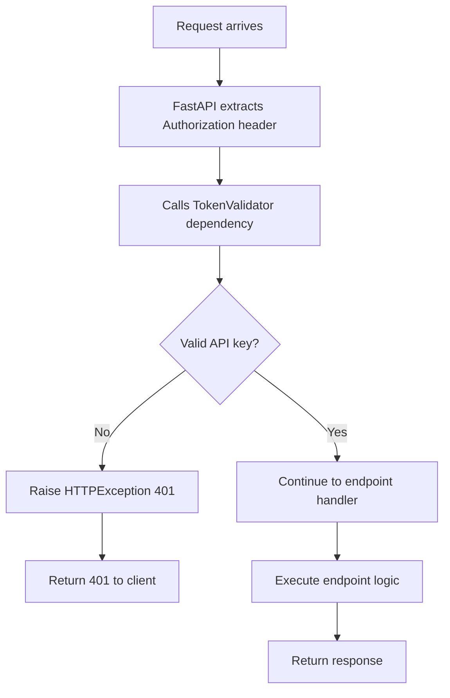
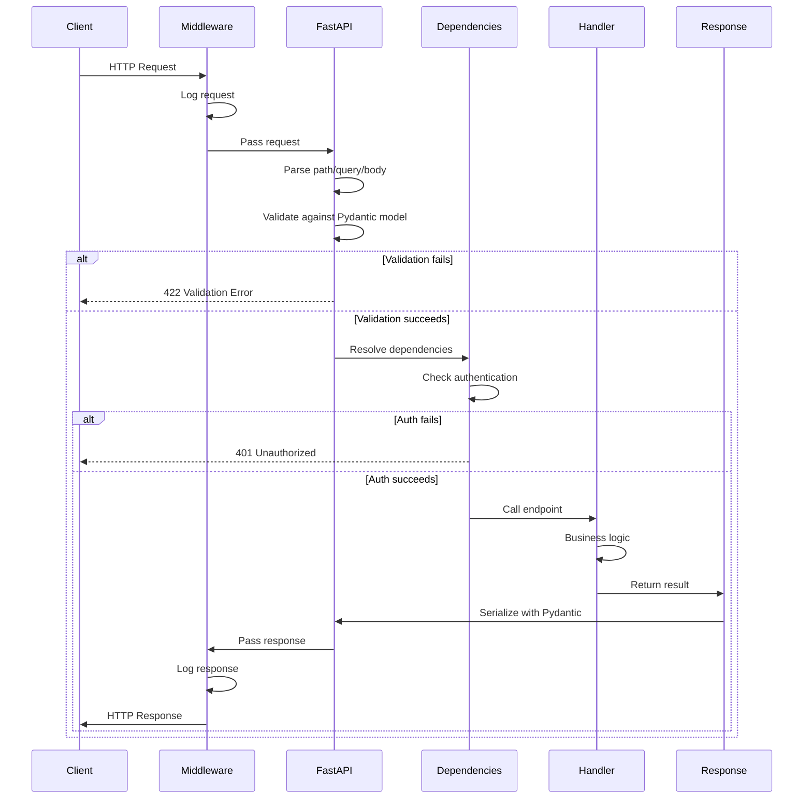

# REST API Framework

AtlasML uses **FastAPI** as its web framework. This guide explains how the REST API is structured, key FastAPI patterns, and how to work with the framework effectively.

---

## Why FastAPI?

FastAPI was chosen for AtlasML because:

1. **Performance**: One of the fastest Python frameworks (comparable to Node.js and Go)
2. **Type Safety**: Automatic validation using Python type hints
3. **Auto-Documentation**: OpenAPI (Swagger) docs generated automatically
4. **Async Support**: Native async/await for concurrent operations
5. **Modern**: Built on modern Python standards (Pydantic, Starlette)

---

## Application Structure

### FastAPI Application Instance

Located in `atlasml/app.py`:

```python
from fastapi import FastAPI

app = FastAPI(
    title="AtlasML API",
    lifespan=lifespan  # Startup/shutdown hooks
)
```

The `app` instance is the core of the application. All routers, middleware, and handlers are registered on this instance.

---

## Routing Strategy

### Versioned API Paths

AtlasML uses **URL path versioning**:

```
/api/v1/health/
/api/v1/competency/suggest
/api/v1/competency/save
```

**Benefits**:
- Clear version boundaries
- Easy to maintain multiple versions
- Client-friendly migration path

### Router Organization

Routers are modular and organized by domain:

```python
# atlasml/routers/health.py
router = APIRouter(prefix="/health", tags=["Health"])

# atlasml/routers/competency.py
router = APIRouter(prefix="/competency", tags=["Competency"])
```

**Registration in app.py**:
```python
from atlasml.routers import health, competency

app.include_router(health.router, prefix="/api/v1")
app.include_router(competency.router, prefix="/api/v1")
```

**Result**:
- Health endpoints: `/api/v1/health/...`
- Competency endpoints: `/api/v1/competency/...`

---

## Request/Response Handling

### Pydantic Models for Validation

FastAPI uses **Pydantic models** for automatic request validation and response serialization.

#### Request Model Example

```python
from pydantic import BaseModel

class SuggestCompetencyRequest(BaseModel):
    description: str
    course_id: int
```

**What FastAPI does automatically**:
1. Parse JSON body
2. Validate types (`description` must be string, `course_id` must be int)
3. Return 422 if validation fails
4. Pass validated object to handler

#### Endpoint Using Request Model

```python
@router.post("/suggest")
async def suggest_competencies(
    request: SuggestCompetencyRequest  # ← Automatic validation
) -> SuggestCompetencyResponse:
    # `request` is guaranteed to be valid here
    description = request.description
    course_id = request.course_id
    # ...
```

#### Response Model

```python
class SuggestCompetencyResponse(BaseModel):
    competencies: list[Competency]
```

**What FastAPI does automatically**:
1. Serialize response object to JSON
2. Validate response matches schema
3. Include schema in OpenAPI docs

---

## Automatic Validation

### Type Validation

```python
class SaveCompetencyRequest(BaseModel):
    competencies: Optional[list[Competency]]  # Can be None or list
    exercise: Optional[ExerciseWithCompetencies]
    operation_type: OperationType  # Enum: only "UPDATE" or "DELETE"
```

**Invalid Request**:
```json
{
  "competencies": "not a list",  // ❌ Should be array or null
  "operation_type": "INVALID"     // ❌ Not in enum
}
```

**FastAPI Response**:
```json
{
  "detail": [
    {
      "loc": ["body", "competencies"],
      "msg": "value is not a valid list",
      "type": "type_error.list"
    },
    {
      "loc": ["body", "operation_type"],
      "msg": "value is not a valid enumeration member",
      "type": "type_error.enum"
    }
  ]
}
```

### Custom Validation

Add custom validators to Pydantic models:

```python
from pydantic import BaseModel, validator

class SuggestCompetencyRequest(BaseModel):
    description: str
    course_id: int

    @validator('description')
    def description_not_empty(cls, v):
        if not v.strip():
            raise ValueError('description cannot be empty')
        return v

    @validator('course_id')
    def course_id_positive(cls, v):
        if v <= 0:
            raise ValueError('course_id must be positive')
        return v
```

---

## Authentication Flow

### Dependency Injection Pattern

FastAPI uses **dependency injection** for authentication:

```python
from fastapi import Depends

@router.post("/suggest", dependencies=[Depends(TokenValidator)])
async def suggest_competencies(request: SuggestCompetencyRequest):
    # Only runs if TokenValidator succeeds
```

### How It Works



### TokenValidator Implementation

```python
class TokenValidator:
    def __init__(self, api_keys: List[APIKeyConfig] = Depends(get_api_keys)):
        self.api_keys = api_keys

    async def __call__(self, api_key: str = Depends(_get_api_key)):
        for key in self.api_keys:
            if key.token == api_key:
                return key
        raise HTTPException(status_code=401, detail="Invalid API key")
```

**Dependency Chain**:
1. `Depends(get_api_keys)` → Injects API keys from config
2. `Depends(_get_api_key)` → Extracts `Authorization` header
3. Validates key against configured keys
4. Raises 401 or continues

---

## Error Handling

### Built-in Exception Handling

FastAPI handles common exceptions automatically:

| Exception | Status Code | Use Case |
|-----------|-------------|----------|
| `HTTPException` | Custom | Explicit HTTP errors |
| `RequestValidationError` | 422 | Pydantic validation failure |
| `ValueError` | 500 | Unhandled value errors |
| Any other | 500 | Unhandled exceptions |

### Custom Exception Handler

AtlasML adds a custom handler for validation errors:

```python
from fastapi.exceptions import RequestValidationError
from fastapi.responses import JSONResponse

@app.exception_handler(RequestValidationError)
async def validation_exception_handler(request: Request, exc: RequestValidationError):
    logger.error(f"❌ Validation error for {request.method} {request.url.path}")
    logger.error(f"❌ Validation details: {exc.errors()}")

    return JSONResponse(
        status_code=422,
        content={
            "detail": exc.errors(),
            "body": (await request.body()).decode()
        }
    )
```

**Benefits**:
- Logs validation errors for debugging
- Returns the invalid body for inspection
- Helps developers fix malformed requests

### Raising HTTP Exceptions

In your endpoint handlers:

```python
from fastapi import HTTPException

@router.post("/suggest")
async def suggest_competencies(request: SuggestCompetencyRequest):
    if request.course_id not in valid_courses:
        raise HTTPException(
            status_code=404,
            detail=f"Course {request.course_id} not found"
        )
    # ...
```

---

## OpenAPI Documentation

### Automatic Schema Generation

FastAPI generates OpenAPI 3.0 schemas automatically from:
- Pydantic models
- Type hints
- Docstrings
- Route decorators

### Swagger UI

Access at: http://localhost:8000/docs

Features:
- Interactive API testing
- Request/response examples
- Authentication testing
- Schema browsing

### Customizing Docs

Add descriptions to endpoints:

```python
@router.post(
    "/suggest",
    response_model=SuggestCompetencyResponse,
    summary="Suggest Competencies",
    description="Returns a list of competencies similar to the provided description",
    response_description="List of suggested competencies ranked by relevance"
)
async def suggest_competencies(request: SuggestCompetencyRequest):
    ...
```

Add examples to models:

```python
class SuggestCompetencyRequest(BaseModel):
    description: str
    course_id: int

    class Config:
        json_schema_extra = {
            "example": {
                "description": "Understanding of object-oriented programming",
                "course_id": 1
            }
        }
```

---

## Async vs Sync

### When to Use Async

Use `async def` for:
- I/O-bound operations (database, API calls)
- Operations that can run concurrently
- Long-running tasks

```python
@router.post("/suggest")
async def suggest_competencies(request: SuggestCompetencyRequest):
    # Can await other async operations
    result = await some_async_operation()
    return result
```

### When to Use Sync

Use regular `def` for:
- CPU-bound operations (heavy computation)
- Operations that block
- Synchronous libraries

```python
@router.post("/compute")
def compute_heavy_task(data: ComputeRequest):
    # Blocks but doesn't prevent other requests
    result = heavy_computation(data)
    return result
```

:::tip
FastAPI runs sync functions in a thread pool, so they won't block async operations.
:::

---

## Dependency Injection Patterns

### Reusable Dependencies

```python
def get_weaviate_client() -> WeaviateClient:
    return WeaviateClientSingleton.get_instance()

@router.post("/suggest")
async def suggest_competencies(
    request: SuggestCompetencyRequest,
    weaviate_client: WeaviateClient = Depends(get_weaviate_client)
):
    # Use weaviate_client
    results = weaviate_client.search(...)
    return results
```

### Nested Dependencies

```python
def get_settings() -> Settings:
    return Settings.get_settings()

def get_api_keys(settings: Settings = Depends(get_settings)) -> List[APIKeyConfig]:
    return settings.api_keys

class TokenValidator:
    def __init__(self, api_keys: List[APIKeyConfig] = Depends(get_api_keys)):
        # api_keys automatically resolved through chain
        self.api_keys = api_keys
```

---

## Response Status Codes

### Specifying Status Codes

```python
from fastapi import status

@router.post("/save", status_code=status.HTTP_200_OK)
async def save_competencies(request: SaveCompetencyRequest):
    # Default 200 response
    return {}

@router.post("/create", status_code=status.HTTP_201_CREATED)
async def create_competency(competency: Competency):
    # Returns 201 for resource creation
    return competency
```

### Multiple Status Codes

Document multiple possible responses:

```python
@router.post(
    "/suggest",
    responses={
        200: {"description": "Successful response"},
        401: {"description": "Invalid API key"},
        422: {"description": "Validation error"},
        500: {"description": "Internal server error"}
    }
)
async def suggest_competencies(request: SuggestCompetencyRequest):
    ...
```

---

## Request/Response Lifecycle

### Complete Flow



---

## Best Practices

### 1. Use Type Hints Everywhere

```python
# ✅ Good
@router.get("/item/{item_id}")
async def get_item(item_id: int) -> Item:
    ...

# ❌ Bad
@router.get("/item/{item_id}")
async def get_item(item_id):
    ...
```

### 2. Leverage Pydantic Models

```python
# ✅ Good - Automatic validation
class CreateItemRequest(BaseModel):
    name: str
    price: float

@router.post("/items")
async def create_item(request: CreateItemRequest):
    ...

# ❌ Bad - Manual validation
@router.post("/items")
async def create_item(name: str, price: float):
    if not name:
        raise HTTPException(400, "Name required")
    ...
```

### 3. Use Dependency Injection

```python
# ✅ Good - Testable, reusable
@router.post("/suggest")
async def suggest(
    request: Request,
    client: WeaviateClient = Depends(get_weaviate_client)
):
    results = client.search(...)
    return results

# ❌ Bad - Hard to test
@router.post("/suggest")
async def suggest(request: Request):
    client = WeaviateClient()  # Creates new instance
    results = client.search(...)
    return results
```

### 4. Document Your Endpoints

```python
@router.post(
    "/suggest",
    summary="Suggest competencies",
    description="Returns competencies similar to the input description",
    response_description="Ranked list of competencies"
)
async def suggest_competencies(request: SuggestCompetencyRequest):
    """
    Suggest competencies based on semantic similarity.

    - **description**: Natural language description of desired competency
    - **course_id**: ID of the course to search within
    """
    ...
```

### 5. Handle Errors Gracefully

```python
@router.post("/suggest")
async def suggest_competencies(request: SuggestCompetencyRequest):
    try:
        results = await generate_suggestions(request)
        return results
    except WeaviateConnectionError:
        raise HTTPException(503, "Database unavailable")
    except OpenAIError:
        raise HTTPException(502, "Embedding service unavailable")
    except Exception as e:
        logger.error(f"Unexpected error: {e}")
        raise HTTPException(500, "Internal server error")
```

---

## Testing FastAPI Endpoints

### Using TestClient

```python
from fastapi.testclient import TestClient
from atlasml.app import app

client = TestClient(app)

def test_suggest_competencies():
    response = client.post(
        "/api/v1/competency/suggest",
        headers={"Authorization": "test-key"},
        json={
            "description": "Python programming",
            "course_id": 1
        }
    )
    assert response.status_code == 200
    assert "competencies" in response.json()
```

See **[Testing Guide](./testing.md)** for more details.

---

## Performance Optimization

### 1. Use Background Tasks

For operations that don't need immediate response:

```python
from fastapi import BackgroundTasks

@router.post("/save")
async def save_competency(
    request: SaveRequest,
    background_tasks: BackgroundTasks
):
    background_tasks.add_task(update_embeddings, request.competency_id)
    return {"status": "accepted"}
```

### 2. Enable Response Caching

For frequently requested data:

```python
from functools import lru_cache

@lru_cache(maxsize=100)
def get_competencies_for_course(course_id: int):
    return fetch_from_database(course_id)
```

### 3. Use Async Database Clients

For better concurrency:

```python
# Instead of sync
results = weaviate_client.search(query)

# Use async if available
results = await weaviate_client.async_search(query)
```

---

## Next Steps

- **[Middleware Documentation](./middleware.md)**: Understand request/response processing
- **[Endpoints](./endpoints.md)**: Detailed API endpoint documentation
- **[Testing Guide](./testing.md)**: Test FastAPI endpoints
- **[Development Workflow](./development-workflow.md)**: Adding new endpoints

---

## Resources

- **FastAPI Documentation**: https://fastapi.tiangolo.com/
- **Pydantic Documentation**: https://docs.pydantic.dev/
- **Starlette Documentation**: https://www.starlette.io/
- **OpenAPI Specification**: https://swagger.io/specification/
