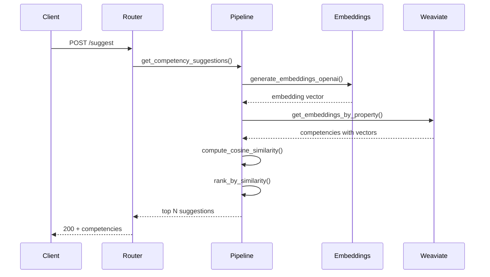
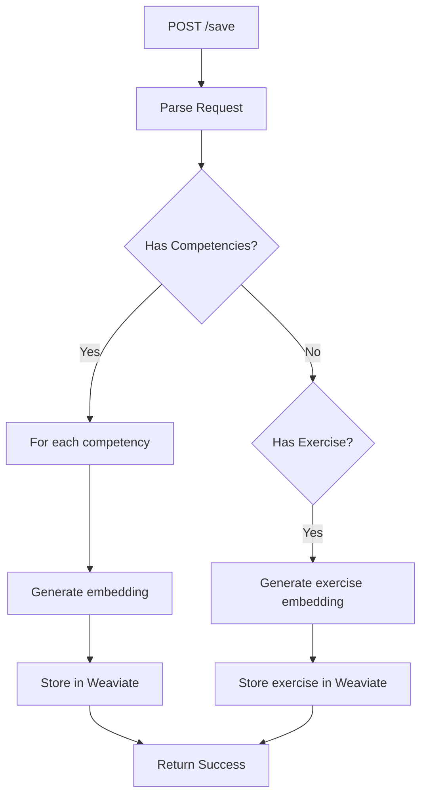
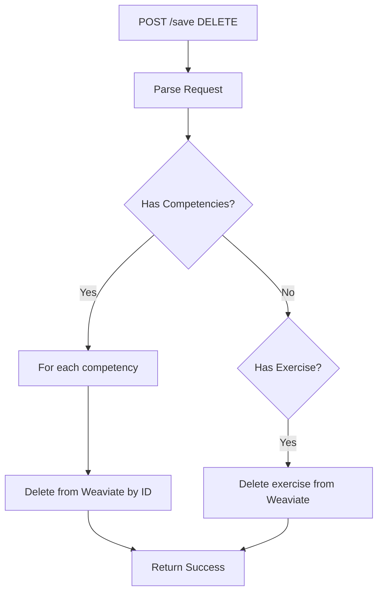
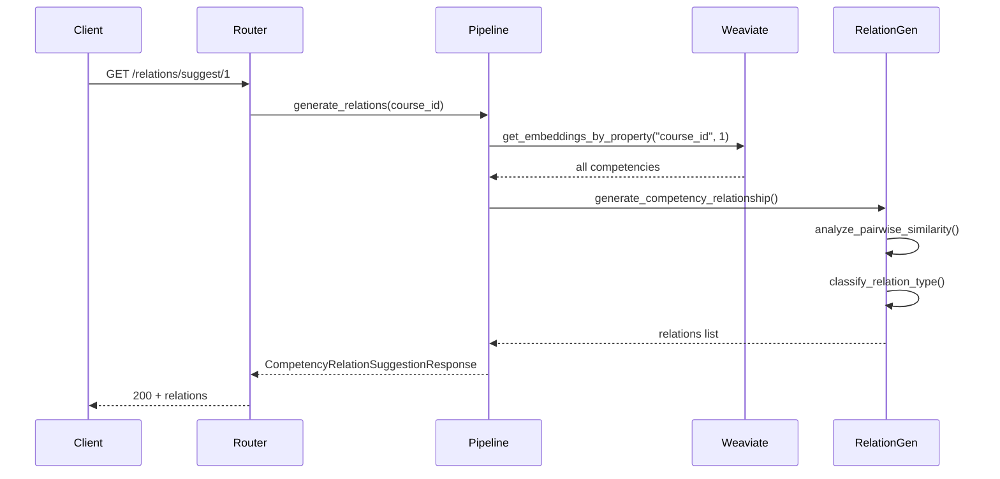

# AtlasML API Endpoints

This guide provides detailed documentation for every API endpoint in AtlasML, including request/response schemas, authentication requirements, and usage examples.

---

## Base URL

All endpoints are prefixed with `/api/v1/`.

**Local Development**:
```
http://localhost:8000/api/v1/
```

**Production** (example):
```
https://atlasml.example.com/api/v1/
```

---

## Authentication

Most endpoints require an API key in the `Authorization` header:

```bash
Authorization: your-api-key-here
```

:::warning
Use HTTPS in production to protect API keys during transmission.
:::

**Obtaining API Keys**:
- Configured in the `.env` file via `ATLAS_API_KEYS`
- Format: JSON array, e.g., `["key1","key2"]`
- Contact your system administrator for production keys

---

## Health Endpoints

### `GET /health/`

Check if the AtlasML service is running and healthy.

#### Authentication
None required.

#### Request
```bash
curl http://localhost:8000/api/v1/health/
```

#### Response
**Status**: 200 OK

```json
[]
```

#### Use Cases
- Docker healthchecks
- Kubernetes liveness/readiness probes
- Load balancer health monitoring
- Uptime monitoring tools

#### Internal Flow


**Implementation**: `atlasml/routers/health.py:7`

---

## Competency Endpoints

### `POST /competency/suggest`

Suggest competencies similar to a given description.

#### Authentication
**Required**: Valid API key in `Authorization` header.

#### Request

**Endpoint**: `POST /api/v1/competency/suggest`

**Headers**:
```
Content-Type: application/json
Authorization: your-api-key
```

**Body**: `SuggestCompetencyRequest`
```json
{
  "description": "Understanding of object-oriented programming concepts including inheritance and polymorphism",
  "course_id": 1
}
```

**Fields**:
- `description` (string, required): Natural language description of the desired competency
- `course_id` (integer, required): ID of the course to search within

#### Response

**Status**: 200 OK

**Body**: `SuggestCompetencyResponse`
```json
{
  "competencies": [
    {
      "id": 42,
      "title": "Object-Oriented Programming",
      "description": "Understand OOP principles including encapsulation, inheritance, and polymorphism",
      "course_id": 1
    },
    {
      "id": 15,
      "title": "Java Programming Fundamentals",
      "description": "Basic Java syntax and OOP concepts",
      "course_id": 1
    }
  ]
}
```

**Fields**:
- `competencies`: Array of `Competency` objects ranked by relevance

#### Error Responses

**400 Bad Request**:
```json
{
  "detail": "Invalid request body"
}
```

**401 Unauthorized**:
```json
{
  "detail": "Invalid API key"
}
```

**500 Internal Server Error**:
```json
{
  "detail": "Failed to generate suggestions"
}
```

#### Example Usage

**cURL**:
```bash
curl -X POST "http://localhost:8000/api/v1/competency/suggest" \
  -H "Content-Type: application/json" \
  -H "Authorization: test-key-123" \
  -d '{
    "description": "Data structures and algorithms",
    "course_id": 1
  }'
```

**Python**:
```python
import requests

response = requests.post(
    "http://localhost:8000/api/v1/competency/suggest",
    headers={
        "Content-Type": "application/json",
        "Authorization": "test-key-123"
    },
    json={
        "description": "Data structures and algorithms",
        "course_id": 1
    }
)

suggestions = response.json()
for comp in suggestions["competencies"]:
    print(f"{comp['id']}: {comp['title']}")
```

**JavaScript (Fetch)**:
```javascript
const response = await fetch('http://localhost:8000/api/v1/competency/suggest', {
  method: 'POST',
  headers: {
    'Content-Type': 'application/json',
    'Authorization': 'test-key-123'
  },
  body: JSON.stringify({
    description: 'Data structures and algorithms',
    course_id: 1
  })
});

const data = await response.json();
console.log(data.competencies);
```

#### Internal Flow



**Steps**:
1. Generate embedding for input description using OpenAI or local model
2. Fetch all competencies for the specified `course_id` from Weaviate
3. Compute cosine similarity between input embedding and each competency
4. Rank competencies by similarity score (highest first)
5. Return top N results (default: all matches above threshold)

#### Performance Considerations
- **Embedding generation**: ~100-500ms (OpenAI) or ~10-50ms (local)
- **Vector search**: ~10-100ms depending on collection size
- **Total**: Usually < 1 second

#### Implementation
**File**: `atlasml/routers/competency.py:47`
**Pipeline**: `atlasml/ml/pipeline_workflows.py`

---

### `POST /competency/save`

Save or delete competencies and/or exercises.

#### Authentication
**Required**: Valid API key in `Authorization` header.

#### Request

**Endpoint**: `POST /api/v1/competency/save`

**Headers**:
```
Content-Type: application/json
Authorization: your-api-key
```

**Body**: `SaveCompetencyRequest`

**Example 1** - Save Competencies:
```json
{
  "competencies": [
    {
      "id": 100,
      "title": "Machine Learning Basics",
      "description": "Understand supervised and unsupervised learning",
      "course_id": 2
    },
    {
      "id": 101,
      "title": "Neural Networks",
      "description": "Deep learning and neural network architectures",
      "course_id": 2
    }
  ],
  "exercise": null,
  "operation_type": "UPDATE"
}
```

**Example 2** - Save Exercise with Competencies:
```json
{
  "competencies": null,
  "exercise": {
    "id": 50,
    "title": "Implement Binary Search",
    "description": "Write an efficient binary search algorithm",
    "competencies": [42, 43],
    "course_id": 1
  },
  "operation_type": "UPDATE"
}
```

**Example 3** - Delete Competencies:
```json
{
  "competencies": [
    {
      "id": 100,
      "title": "Obsolete Competency",
      "description": "",
      "course_id": 2
    }
  ],
  "exercise": null,
  "operation_type": "DELETE"
}
```

**Fields**:
- `competencies` (array, optional): List of competencies to save/delete
- `exercise` (object, optional): Single exercise to save/delete
- `operation_type` (string, required): Either `"UPDATE"` or `"DELETE"`

:::note
At least one of `competencies` or `exercise` must be provided.
:::

#### Response

**Status**: 200 OK

**Body**:
```json
{}
```

Empty object indicates success.

#### Error Responses

**400 Bad Request**:
```json
{
  "detail": "Either competencies or exercise must be provided"
}
```

**401 Unauthorized**:
```json
{
  "detail": "Invalid API key"
}
```

**500 Internal Server Error**:
```json
{
  "detail": "Failed to save competencies"
}
```

#### Example Usage

**cURL - Save Competency**:
```bash
curl -X POST "http://localhost:8000/api/v1/competency/save" \
  -H "Content-Type: application/json" \
  -H "Authorization: test-key-123" \
  -d '{
    "competencies": [
      {
        "id": 200,
        "title": "REST API Design",
        "description": "Designing RESTful web services",
        "course_id": 3
      }
    ],
    "exercise": null,
    "operation_type": "UPDATE"
  }'
```

**Python - Delete Competency**:
```python
import requests

response = requests.post(
    "http://localhost:8000/api/v1/competency/save",
    headers={
        "Authorization": "test-key-123",
        "Content-Type": "application/json"
    },
    json={
        "competencies": [
            {
                "id": 200,
                "title": "Obsolete",
                "description": "",
                "course_id": 3
            }
        ],
        "exercise": None,
        "operation_type": "DELETE"
    }
)

print(response.status_code)  # 200
```

#### Internal Flow

**UPDATE Operation**:


**DELETE Operation**:


**Steps** (UPDATE):
1. Validate request (at least one of competencies/exercise)
2. For each competency:
   - Generate embedding from description
   - Store vector + properties in Weaviate
3. For exercise (if provided):
   - Generate embedding from description
   - Store with competency associations
4. Return 200 OK

**Steps** (DELETE):
1. Validate request
2. For each competency/exercise:
   - Delete from Weaviate by `competency_id` or `exercise_id`
3. Return 200 OK

#### Use Cases
- Syncing competencies from main application to AtlasML
- Updating competency descriptions and regenerating embeddings
- Removing outdated or deleted competencies
- Associating exercises with competencies

#### Implementation
**File**: `atlasml/routers/competency.py:87`
**Pipeline**: `atlasml/ml/pipeline_workflows.py`

---

### `GET /competency/relations/suggest/{course_id}`

Generate suggested relationships between competencies in a course.

#### Authentication
**Required**: Valid API key in `Authorization` header.

#### Request

**Endpoint**: `GET /api/v1/competency/relations/suggest/{course_id}`

**Path Parameters**:
- `course_id` (integer): ID of the course

**Headers**:
```
Authorization: your-api-key
```

#### Response

**Status**: 200 OK

**Body**: `CompetencyRelationSuggestionResponse`
```json
{
  "relations": [
    {
      "tail_id": 10,
      "head_id": 15,
      "relation_type": "REQUIRES"
    },
    {
      "tail_id": 15,
      "head_id": 20,
      "relation_type": "EXTENDS"
    },
    {
      "tail_id": 12,
      "head_id": 13,
      "relation_type": "MATCHES"
    }
  ]
}
```

**Relation Types**:
- `REQUIRES`: `tail_id` is a prerequisite for `head_id`
- `EXTENDS`: `tail_id` builds upon or expands `head_id`
- `MATCHES`: `tail_id` and `head_id` are similar or equivalent

**Fields**:
- `relations`: Array of directed edges between competencies
  - `tail_id`: Source competency ID
  - `head_id`: Target competency ID
  - `relation_type`: Type of relationship

#### Error Responses

**401 Unauthorized**:
```json
{
  "detail": "Invalid API key"
}
```

**404 Not Found**:
```json
{
  "detail": "No competencies found for course"
}
```

**500 Internal Server Error**:
```json
{
  "detail": "Failed to generate relations"
}
```

#### Example Usage

**cURL**:
```bash
curl -X GET "http://localhost:8000/api/v1/competency/relations/suggest/1" \
  -H "Authorization: test-key-123"
```

**Python**:
```python
import requests

response = requests.get(
    "http://localhost:8000/api/v1/competency/relations/suggest/1",
    headers={"Authorization": "test-key-123"}
)

relations = response.json()["relations"]
for rel in relations:
    print(f"{rel['tail_id']} --{rel['relation_type']}--> {rel['head_id']}")
```

#### Internal Flow



**Steps**:
1. Fetch all competencies for the specified course from Weaviate
2. For each pair of competencies:
   - Compute embedding similarity
   - Analyze description keywords
   - Classify relationship type (REQUIRES, EXTENDS, MATCHES)
3. Filter weak relationships (below similarity threshold)
4. Return directed graph as edge list

#### Use Cases
- Building competency knowledge graphs
- Suggesting course prerequisites
- Curriculum design support
- Visualizing competency hierarchies

:::note Current Implementation
The relation generation is currently **heuristic-based** (random selection for demonstration). In a production system, this should use ML models trained on relationship data.
:::

#### Future Enhancements
- Train a classifier on labeled relationship data
- Incorporate course structure (lecture order, dependencies)
- Use graph neural networks for relationship prediction

#### Implementation
**File**: `atlasml/routers/competency.py:162`
**Generator**: `atlasml/ml/generate_competency_relationship.py`

---

## Interactive API Documentation

AtlasML provides auto-generated interactive API documentation:

### Swagger UI
**URL**: http://localhost:8000/docs

Features:
- Try endpoints directly from browser
- See request/response schemas
- View validation rules
- Test authentication

### ReDoc
**URL**: http://localhost:8000/redoc

Features:
- Clean, readable format
- Searchable documentation
- Code samples
- Schema definitions

:::tip
Use Swagger UI for testing endpoints during development!
:::

---

## Rate Limiting

Currently, AtlasML does **not** implement rate limiting. Consider adding rate limiting in production:

- **Per API key**: 100 requests/minute
- **Global**: 1000 requests/minute

Recommended tools:
- [Slowapi](https://github.com/laurents/slowapi)
- API Gateway (nginx, Kong, AWS API Gateway)

---

## Versioning

AtlasML uses **URL path versioning**:

- Current version: `/api/v1/`
- Future versions: `/api/v2/`, `/api/v3/`, etc.

**Breaking Changes**:
- Create new version path
- Maintain old version for compatibility
- Document migration guide

**Non-Breaking Changes**:
- Add optional fields
- Add new endpoints
- Keep same version

---

## Error Response Format

All errors follow a consistent structure:

```json
{
  "detail": "Error message or validation errors"
}
```

**Status Codes**:
- `200`: Success
- `400`: Bad Request (invalid input)
- `401`: Unauthorized (missing/invalid API key)
- `403`: Forbidden (insufficient permissions)
- `404`: Not Found
- `422`: Unprocessable Entity (validation error)
- `500`: Internal Server Error

**Validation Errors** (422):
```json
{
  "detail": [
    {
      "loc": ["body", "description"],
      "msg": "field required",
      "type": "value_error.missing"
    }
  ],
  "body": "{\"course_id\": 1}"
}
```

---

## Best Practices

### API Key Security
- Store keys in environment variables, not code
- Use different keys for dev/staging/production
- Rotate keys regularly
- Never log API keys

### Request Optimization
- Batch operations when possible
- Cache frequent queries
- Use appropriate timeouts
- Handle rate limits gracefully

### Error Handling
```python
try:
    response = requests.post(url, json=data, timeout=10)
    response.raise_for_status()
except requests.exceptions.Timeout:
    print("Request timed out")
except requests.exceptions.HTTPError as e:
    print(f"HTTP error: {e.response.status_code}")
```

---

## Next Steps

- **[REST API Framework](./rest-api.md)**: Understand the FastAPI architecture
- **[ML Pipelines](./ml-pipelines.md)**: Learn how endpoints process data
- **[Testing Guide](../testing.md)**: Test endpoints locally
- **[Troubleshooting](/admin/atlasml-troubleshooting.md)**: Debug API issues

:::tip Need Examples?
Check the `tests/routers/` directory for working examples of how to call each endpoint!
:::
