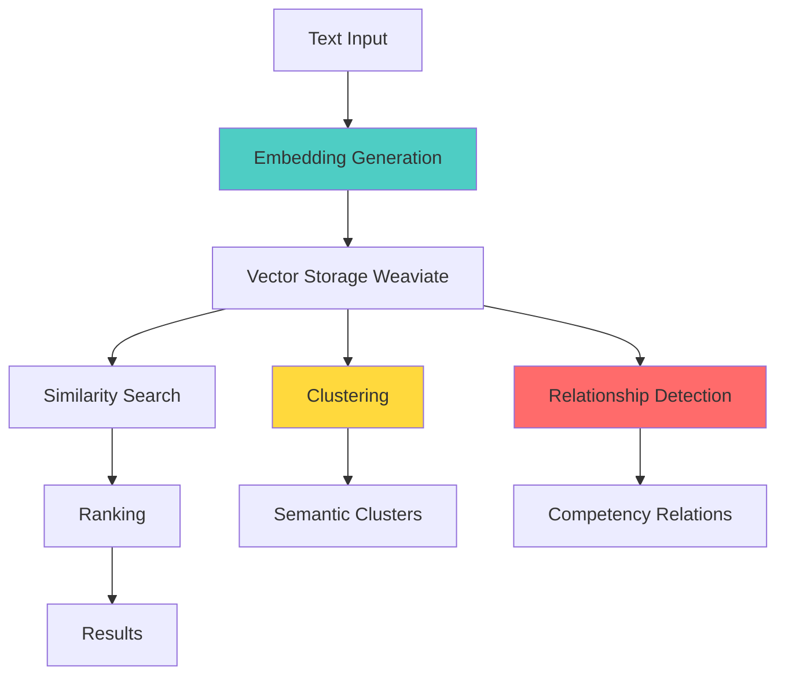
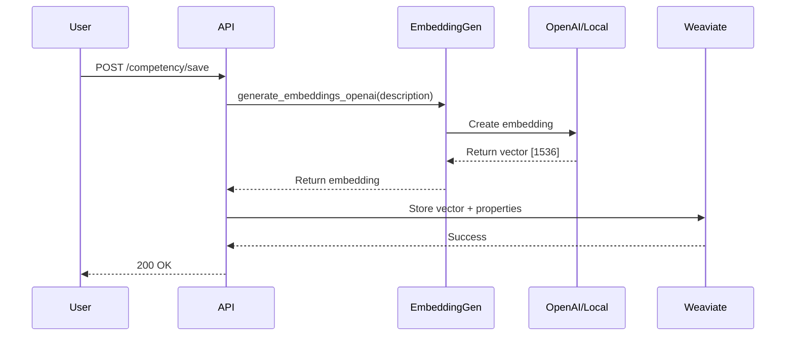
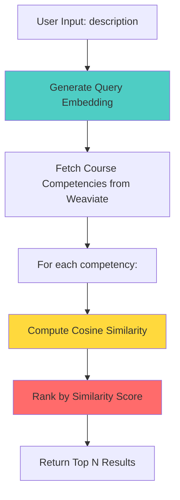
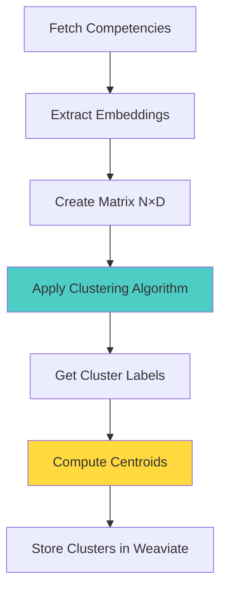
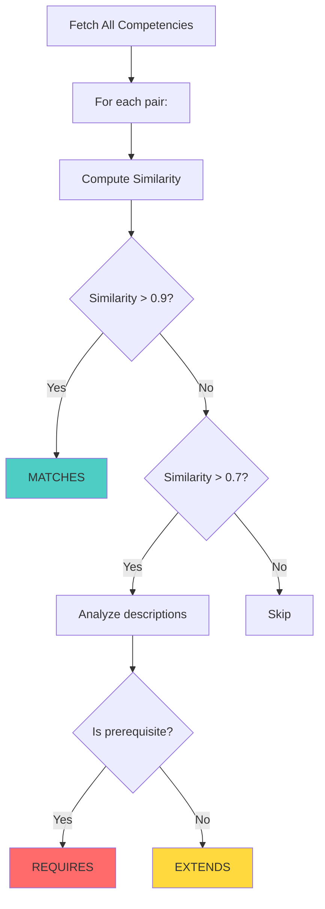
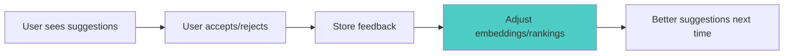

# ML Pipelines

AtlasML uses machine learning to power competency suggestions, clustering, and relationship detection. This guide explains how the ML pipelines work and how to extend them.

---

## Overview

### ML Components



**Key Pipelines**:
1. **Embedding Generation**: Convert text to vectors
2. **Competency Suggestion**: Find similar competencies
3. **Clustering**: Group related items
4. **Relationship Detection**: Discover connections

---

## 1. Embedding Generation Pipeline

### What are Embeddings?

**Embeddings** are numerical representations of text that capture semantic meaning.

**Example**:
```python
text1 = "Python programming"
embedding1 = [0.123, -0.456, 0.789, ...]  # 1536 numbers

text2 = "Coding in Python"
embedding2 = [0.145, -0.423, 0.801, ...]  # Similar values!

text3 = "Making pizza"
embedding3 = [-0.789, 0.234, -0.156, ...]  # Very different values
```

Similar texts have similar embeddings, enabling **semantic search**.

---

### Models Available

#### OpenAI Text Embedding (Azure)

**File**: `atlasml/ml/embeddings.py`

```python
from atlasml.ml.embeddings import EmbeddingGenerator

generator = EmbeddingGenerator()
embedding = generator.generate_embeddings_openai(
    "Understanding of object-oriented programming"
)

print(len(embedding))  # 1536
```

**Specifications**:
- Model: `text-embedding-ada-002`
- Dimensions: 1536
- Max tokens: 8191
- Provider: Azure OpenAI

**Pros**:
- High quality
- Excellent semantic understanding
- Multilingual

**Cons**:
- Requires API key
- Network latency (~100-500ms)
- Costs per 1000 tokens

---

#### SentenceTransformers (Local)

```python
embedding = generator.generate_embeddings(
    "Understanding of object-oriented programming"
)

print(len(embedding))  # 384
```

**Specifications**:
- Model: `all-MiniLM-L6-v2`
- Dimensions: 384
- Max tokens: 256
- Provider: Local (Hugging Face)

**Pros**:
- Free
- Fast (~10-50ms)
- No internet required
- Privacy (no data leaves server)

**Cons**:
- Lower quality than OpenAI
- Fewer dimensions
- English-focused

---

### Embedding Generation Flow



**Code Example**:

```python
from atlasml.ml.embeddings import EmbeddingGenerator
from atlasml.clients.weaviate import get_weaviate_client, CollectionNames

def save_competency_with_embedding(competency):
    # 1. Generate embedding
    generator = EmbeddingGenerator()
    embedding = generator.generate_embeddings_openai(
        competency.description
    )

    # 2. Store in Weaviate
    client = get_weaviate_client()
    uuid = client.add_embeddings(
        collection_name=CollectionNames.COMPETENCY.value,
        embeddings=embedding,
        properties={
            "competency_id": competency.id,
            "title": competency.title,
            "description": competency.description,
            "course_id": competency.course_id
        }
    )

    return uuid
```

---

## 2. Competency Suggestion Pipeline

### Overview

The **suggestion pipeline** finds competencies similar to a user's description.

### Step-by-Step Flow



### Implementation

**File**: `atlasml/ml/pipeline_workflows.py`

```python
def get_competency_suggestions(
    self,
    description: str,
    course_id: int,
    top_n: int = 5
) -> list[Competency]:
    # 1. Generate embedding for input
    generator = EmbeddingGenerator()
    query_embedding = generator.generate_embeddings_openai(description)

    # 2. Get all competencies for the course
    competencies = self.weaviate_client.get_embeddings_by_property(
        collection_name=CollectionNames.COMPETENCY.value,
        property_name="course_id",
        property_value=course_id
    )

    # 3. Compute similarity for each
    from atlasml.ml.similarity_measures import compute_cosine_similarity

    results = []
    for comp in competencies:
        similarity = compute_cosine_similarity(
            query_embedding,
            comp["vector"]
        )
        results.append({
            "competency": comp["properties"],
            "similarity": similarity
        })

    # 4. Rank by similarity (highest first)
    results.sort(key=lambda x: x["similarity"], reverse=True)

    # 5. Convert to Competency objects
    suggestions = []
    for r in results[:top_n]:
        suggestions.append(Competency(**r["competency"]))

    return suggestions
```

### Similarity Computation

**Cosine Similarity** measures the angle between two vectors:

```python
def compute_cosine_similarity(vec1, vec2):
    # cos(θ) = (A · B) / (||A|| * ||B||)
    dot_product = sum(a * b for a, b in zip(vec1, vec2))
    magnitude_a = math.sqrt(sum(a**2 for a in vec1))
    magnitude_b = math.sqrt(sum(b**2 for b in vec2))

    return dot_product / (magnitude_a * magnitude_b)
```

**Score Range**:
- `1.0`: Identical vectors (perfect match)
- `0.9 - 1.0`: Very similar
- `0.7 - 0.9`: Similar
- `0.5 - 0.7`: Somewhat similar
- `< 0.5`: Not similar

---

### Example Usage

```python
from atlasml.ml.pipeline_workflows import PipelineWorkflows

pipeline = PipelineWorkflows()

suggestions = pipeline.get_competency_suggestions(
    description="Understanding inheritance and polymorphism in OOP",
    course_id=1
)

for comp in suggestions:
    print(f"{comp.title}: {comp.description}")
```

**Output**:
```
Object-Oriented Programming: Understanding OOP principles...
Java Programming Fundamentals: Introduction to Java and OOP...
Design Patterns: Common software design patterns...
```

---

## 3. Clustering Pipeline

### What is Clustering?

**Clustering** groups similar items together automatically.

**Use Cases**:
- Group related competencies
- Discover themes in a course
- Organize exercises by topic

### Algorithms

#### HDBSCAN (Hierarchical Density-Based Clustering)

**File**: `atlasml/ml/clustering.py`

```python
from atlasml.ml.clustering import apply_hdbscan
import numpy as np

# Matrix: N competencies × D dimensions
embeddings_matrix = np.array([
    [0.1, 0.2, 0.3, ...],  # Competency 1
    [0.15, 0.22, 0.29, ...],  # Competency 2 (similar to 1)
    [0.8, 0.9, -0.1, ...],  # Competency 3 (different)
    ...
])

labels, centroids, medoids = apply_hdbscan(
    matrix=embeddings_matrix,
    min_cluster_size=3,
    metric="cosine"
)

print(labels)  # [0, 0, 1, 1, 1, -1, 2, 2]
# -1 = noise (doesn't belong to any cluster)
```

**Parameters**:
- `min_cluster_size`: Minimum points per cluster
- `min_samples`: Min neighborhood size
- `metric`: Distance metric (euclidean, cosine)
- `eps`: Max distance for neighborhood

**Output**:
- `labels`: Cluster assignment for each point (-1 = noise)
- `centroids`: Average point of each cluster
- `medoids`: Most representative point of each cluster

---

#### K-Means Clustering

```python
from atlasml.ml.clustering import apply_kmeans

labels, centroids = apply_kmeans(
    matrix=embeddings_matrix,
    n_clusters=5,
    random_state=42
)

print(labels)  # [0, 0, 1, 2, 2, 3, 4, 4]
```

**Parameters**:
- `n_clusters`: Number of clusters (must specify)
- `random_state`: Seed for reproducibility

**When to Use**:
- **HDBSCAN**: Unknown number of clusters, can handle noise
- **K-Means**: Known number of clusters, faster

---

### Clustering Workflow



**Example**:

```python
def cluster_competencies(course_id: int):
    # 1. Fetch competencies
    client = get_weaviate_client()
    competencies = client.get_embeddings_by_property(
        collection_name="Competency",
        property_name="course_id",
        property_value=course_id
    )

    # 2. Extract embeddings
    embeddings = [comp["vector"] for comp in competencies]
    matrix = np.array(embeddings)

    # 3. Cluster
    from atlasml.ml.clustering import apply_hdbscan
    labels, centroids, _ = apply_hdbscan(
        matrix=matrix,
        min_cluster_size=3,
        metric="cosine"
    )

    # 4. Store clusters
    for cluster_id, centroid in enumerate(centroids):
        client.add_embeddings(
            collection_name="SemanticCluster",
            embeddings=centroid.tolist(),
            properties={
                "cluster_id": f"course_{course_id}_cluster_{cluster_id}",
                "course_id": course_id
            }
        )

    return labels
```

---

## 4. Relationship Detection Pipeline

### Overview

The **relationship pipeline** discovers connections between competencies.

### Relationship Types

```python
class RelationType(str, Enum):
    REQUIRES = "REQUIRES"  # Prerequisite
    EXTENDS = "EXTENDS"     # Builds upon
    MATCHES = "MATCHES"     # Similar/equivalent
```

**Examples**:
- "Python Basics" **REQUIRES** "Programming Fundamentals"
- "Advanced Python" **EXTENDS** "Python Basics"
- "OOP in Python" **MATCHES** "Object-Oriented Programming"

---

### Detection Algorithm

**File**: `atlasml/ml/generate_competency_relationship.py`

```python
def generate_competency_relationship(
    competencies: list[Competency]
) -> list[CompetencyRelation]:
    relations = []

    # Compare all pairs
    for i, comp1 in enumerate(competencies):
        for j, comp2 in enumerate(competencies[i+1:], start=i+1):
            # Get embeddings
            vec1 = get_embedding(comp1)
            vec2 = get_embedding(comp2)

            # Compute similarity
            similarity = compute_cosine_similarity(vec1, vec2)

            # Classify relationship
            if similarity > 0.9:
                relation_type = RelationType.MATCHES
            elif similarity > 0.7:
                # Analyze descriptions for direction
                if is_prerequisite(comp1, comp2):
                    relation_type = RelationType.REQUIRES
                else:
                    relation_type = RelationType.EXTENDS
            else:
                continue  # Too dissimilar

            relations.append(CompetencyRelation(
                tail_id=comp1.id,
                head_id=comp2.id,
                relation_type=relation_type
            ))

    return relations
```

### Flow Diagram



:::note Current Implementation
The relationship detection is **heuristic-based** (currently using random selection for demonstration). For production, implement ML-based classification trained on labeled relationship data.
:::

---

## 5. Feedback Loop

### Concept

User feedback improves future suggestions:



### Implementation Outline

**File**: `atlasml/ml/feedback_loop.py`

```python
def incorporate_feedback(
    query_embedding: list[float],
    accepted_competency_id: int,
    rejected_competency_ids: list[int]
):
    # 1. Get accepted competency embedding
    accepted_embedding = get_competency_embedding(accepted_competency_id)

    # 2. Move query closer to accepted
    adjusted_embedding = []
    learning_rate = 0.1
    for q, a in zip(query_embedding, accepted_embedding):
        adjusted = q + learning_rate * (a - q)
        adjusted_embedding.append(adjusted)

    # 3. Store adjusted embedding for future queries
    store_user_preference(adjusted_embedding)

    return adjusted_embedding
```

### Centroid Updates

When adding/removing items from clusters:

```python
from atlasml.ml.centroid_similarity import (
    update_cluster_centroid_on_addition,
    update_cluster_centroid_on_removal
)

# Adding a point
new_centroid = update_cluster_centroid_on_addition(
    current_centroid=current_centroid,
    new_vector=new_embedding,
    cluster_size=10
)

# Removing a point
new_centroid = update_cluster_centroid_on_removal(
    current_centroid=current_centroid,
    removed_vector=removed_embedding,
    cluster_size=9
)
```

---

## Performance Optimization

### 1. Batch Embedding Generation

```python
# ❌ Slow - One at a time
for comp in competencies:
    embedding = generator.generate_embeddings_openai(comp.description)
    save(embedding)

# ✅ Fast - Batch process
descriptions = [c.description for c in competencies]
embeddings = generator.generate_embeddings_batch(descriptions)
for comp, emb in zip(competencies, embeddings):
    save(emb)
```

### 2. Caching

```python
from functools import lru_cache

@lru_cache(maxsize=1000)
def get_competency_embedding(competency_id: int):
    # Cached - only computed once per ID
    return fetch_from_weaviate(competency_id)
```

### 3. Approximate Search

For very large datasets, use approximate nearest neighbors:

```python
# Instead of computing similarity with all items
results = []
for comp in all_competencies:  # 10,000+ items
    similarity = compute_cosine_similarity(query, comp["vector"])
    results.append((comp, similarity))

# Use Weaviate's built-in ANN
results = weaviate_client.search_near_vector(
    query_vector=query,
    limit=10
)
```

---

## Extending ML Pipelines

### Adding a New Embedding Model

1. **Add to EmbeddingGenerator**:

```python
class EmbeddingGenerator:
    @property
    def cohere_client(self):
        if self._cohere_client is None:
            self._cohere_client = cohere.Client(os.getenv("COHERE_API_KEY"))
        return self._cohere_client

    def generate_embeddings_cohere(self, text: str) -> list[float]:
        response = self.cohere_client.embed(
            texts=[text],
            model="embed-english-v3.0"
        )
        return response.embeddings[0]
```

2. **Update pipeline to use new model**:

```python
embedding = generator.generate_embeddings_cohere(description)
```

### Adding a New ML Pipeline

1. **Create pipeline function**:

```python
def recommend_exercises_for_competency(competency_id: int) -> list[Exercise]:
    # 1. Get competency embedding
    comp = get_competency(competency_id)
    comp_embedding = get_embedding(comp)

    # 2. Get all exercises
    exercises = get_all_exercises()

    # 3. Compute similarity
    results = []
    for ex in exercises:
        similarity = compute_cosine_similarity(comp_embedding, ex.embedding)
        results.append((ex, similarity))

    # 4. Sort and return
    results.sort(key=lambda x: x[1], reverse=True)
    return [ex for ex, _ in results[:10]]
```

2. **Add to PipelineWorkflows**:

```python
class PipelineWorkflows:
    def recommend_exercises(self, competency_id: int):
        return recommend_exercises_for_competency(competency_id)
```

3. **Create API endpoint**:

```python
@router.get("/competency/{competency_id}/exercises")
async def get_exercise_recommendations(competency_id: int):
    pipeline = PipelineWorkflows()
    exercises = pipeline.recommend_exercises(competency_id)
    return {"exercises": exercises}
```

---

## Next Steps

- **[Modules Reference](./modules.md)**: Dive into ML module code
- **[Weaviate Integration](./weaviate.md)**: Understand vector storage
- **[Development Process](../development-process/index.md)**: Add new ML features
- **[Test Guide](../testing.md)**: Test ML pipelines

---

## Resources

- **OpenAI Embeddings**: https://platform.openai.com/docs/guides/embeddings
- **SentenceTransformers**: https://www.sbert.net/
- **HDBSCAN**: https://hdbscan.readthedocs.io/
- **Cosine Similarity**: https://en.wikipedia.org/wiki/Cosine_similarity
