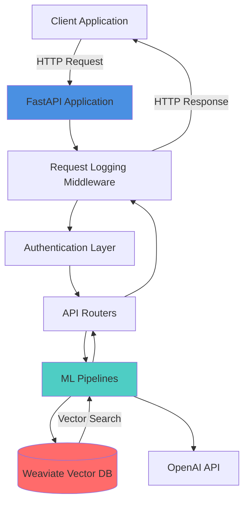
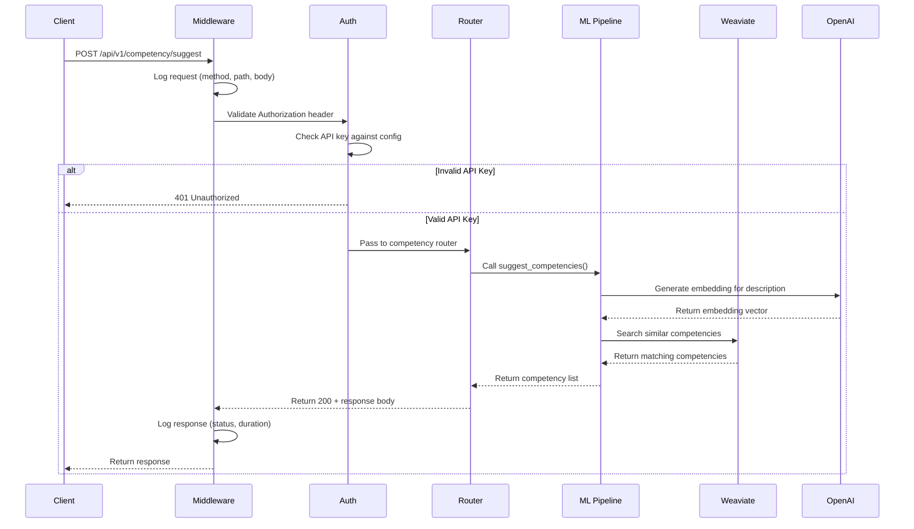
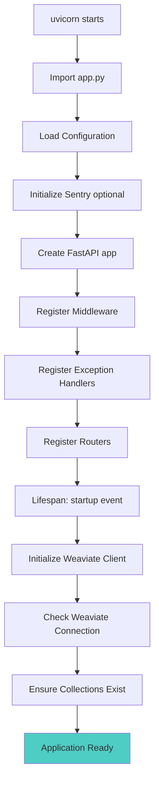
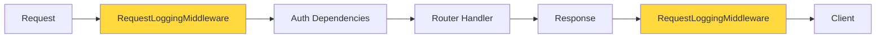
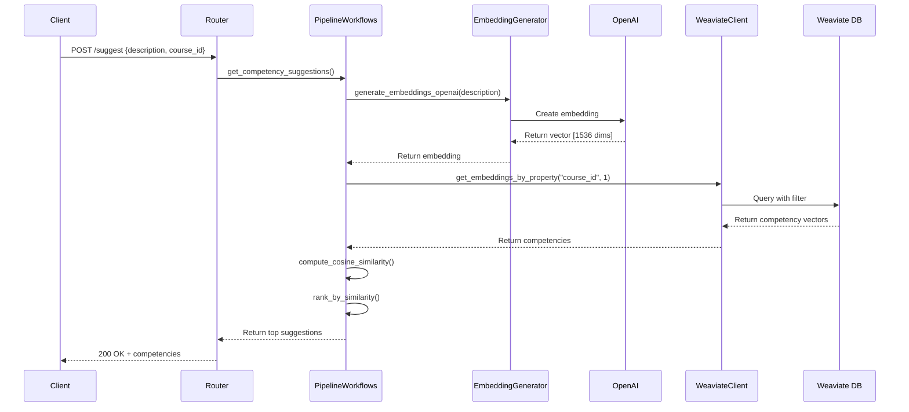
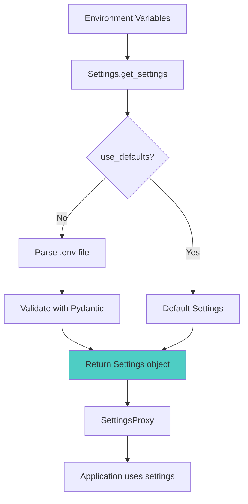
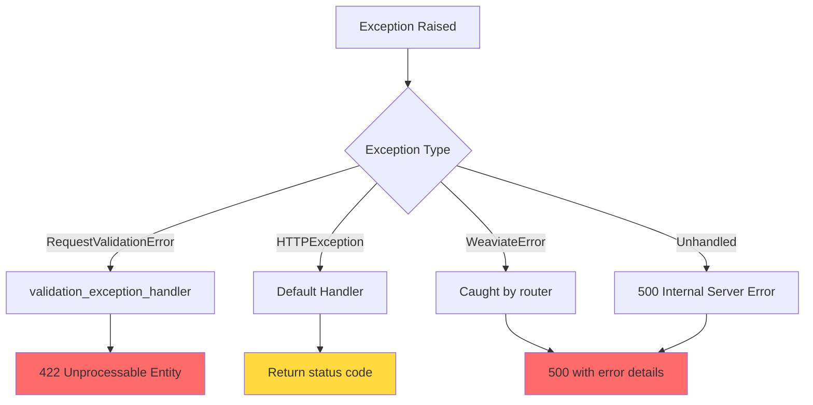
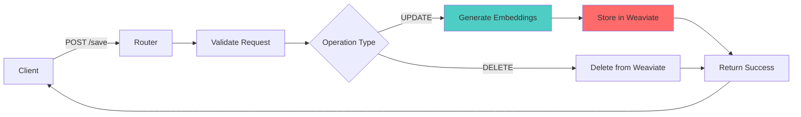
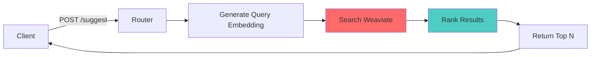
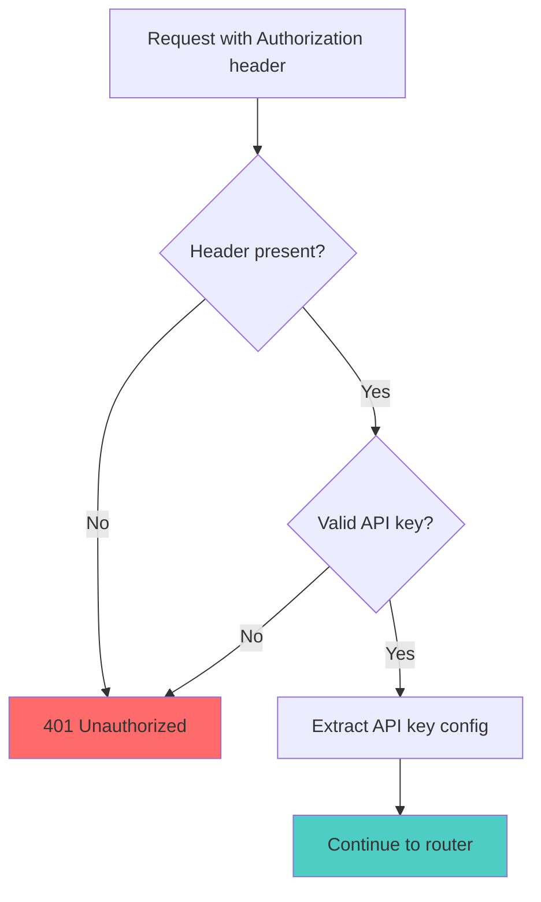

# System Design

This guide explains how AtlasML is architected, how components interact, and the request/response flow through the system.

---

## High-Level Architecture



### Key Components

1. **FastAPI Application** (`app.py`): Entry point, middleware, and router registration
2. **Routers**: Handle specific API endpoints (health, competency)
3. **ML Pipelines**: Orchestrate machine learning workflows
4. **Weaviate Client**: Interface to the vector database
5. **Configuration**: Environment-based settings management
6. **Authentication**: API key validation

---

## Request Flow Diagram

Here's what happens when a client makes a request to AtlasML:



### Flow Breakdown

1. **Request Reception**: Client sends HTTP request to FastAPI
2. **Middleware Processing**: `RequestLoggingMiddleware` logs request details
3. **Authentication**: `TokenValidator` checks the `Authorization` header
4. **Routing**: FastAPI routes to appropriate endpoint handler
5. **Business Logic**: Router calls ML pipeline or service layer
6. **Database Operations**: Weaviate client performs vector operations
7. **External API Calls**: OpenAI generates embeddings (if configured)
8. **Response Building**: Pydantic models serialize the response
9. **Middleware Logging**: Duration and status are logged
10. **Response Return**: Client receives JSON response

---

## Application Initialization

### Startup Sequence

When you run `uvicorn atlasml.app:app`, here's what happens:



### Lifespan Events

The `lifespan` context manager in `app.py` handles startup and shutdown:

```python
@asynccontextmanager
async def lifespan(app):
    # Startup
    logger.info("🚀 Starting AtlasML API...")
    logger.info(f"🔌 Weaviate client status: {'Connected' if get_weaviate_client().is_alive() else 'Disconnected'}")
    logger.info("✅ Weaviate collections initialized")

    yield  # Application is running

    # Shutdown
    logger.info("👋 Shutting down AtlasML API...")
    get_weaviate_client().close()
```

**Startup tasks:**
- Check Weaviate connectivity
- Initialize collections if they don't exist
- Log system status

**Shutdown tasks:**
- Gracefully close Weaviate connection
- Release resources

---

## Middleware Stack

Middleware processes all requests and responses. AtlasML uses:

### 1. RequestLoggingMiddleware

Located in `app.py`, this middleware:

```python
class RequestLoggingMiddleware(BaseHTTPMiddleware):
    async def dispatch(self, request: Request, call_next):
        start_time = time.time()

        # Log request
        logger.info(f"→ {request.method} {request.url.path}")
        if request.method == "POST":
            body = await request.body()
            logger.info(f"📦 Request body: {body.decode()[:200]}")

        # Process request
        response = await call_next(request)

        # Log response
        duration = time.time() - start_time
        logger.info(f"← {response.status_code} ({duration:.3f}s)")

        return response
```

**What it does:**
- Logs incoming request method and path
- Logs POST request bodies (first 200 chars)
- Measures request processing time
- Logs response status and duration

**Why it's useful:**
- Debugging: See all API activity
- Performance: Identify slow endpoints
- Monitoring: Track API usage patterns

### Execution Order



Middleware wraps the entire request/response cycle.

---

## Dependency Injection

AtlasML uses FastAPI's dependency injection for:

### 1. Authentication (`TokenValidator`)

```python
class TokenValidator:
    def __init__(self, api_keys: List[APIKeyConfig] = Depends(get_api_keys)):
        self.api_keys = api_keys

    async def __call__(self, api_key: str = Depends(_get_api_key)) -> APIKeyConfig:
        for key in self.api_keys:
            if key.token == api_key:
                return key
        raise HTTPException(status_code=401, detail="Invalid API key")
```

**How it works:**
1. `Depends(get_api_keys)` injects configured API keys from settings
2. `Depends(_get_api_key)` extracts the `Authorization` header
3. Validates the key against configured keys
4. Raises 401 if invalid, continues if valid

**Usage in routers:**
```python
@router.post("/suggest", dependencies=[Depends(TokenValidator)])
async def suggest_competencies(request: SuggestCompetencyRequest):
    # Only runs if authentication succeeds
    ...
```

### 2. Weaviate Client (`get_weaviate_client`)

```python
def get_weaviate_client(weaviate_settings: WeaviateSettings = None) -> WeaviateClient:
    return WeaviateClientSingleton.get_instance(weaviate_settings)
```

**Singleton Pattern:**
- Only one Weaviate client instance is created
- Reused across all requests
- Connection pooling handled by the SDK

**Why singleton?**
- Efficient: Avoid reconnection overhead
- Safe: Weaviate SDK is thread-safe
- Simple: No need to manage connections

---

## Component Interaction

### Competency Suggestion Flow

Here's a detailed look at how the `/api/v1/competency/suggest` endpoint works:



### File Locations

| Component | File |
|-----------|------|
| Router | `atlasml/routers/competency.py` |
| ML Pipeline | `atlasml/ml/pipeline_workflows.py` |
| Embedding Generator | `atlasml/ml/embeddings.py` |
| Weaviate Client | `atlasml/clients/weaviate.py` |
| Similarity | `atlasml/ml/similarity_measures.py` |

---

## Configuration Management

### Settings Hierarchy



### Settings Model

```python
class Settings(BaseModel):
    api_keys: list[APIKeyConfig]       # API authentication keys
    weaviate: WeaviateSettings         # Weaviate connection config
    sentry_dsn: str | None = None      # Optional Sentry DSN
    env: str = "development"           # Environment name
```

### Configuration Sources

1. **Environment Variables** (`.env` file):
   ```bash
   ATLAS_API_KEYS=["key1","key2"]
   WEAVIATE_HOST=localhost
   WEAVIATE_PORT=8085
   ```

2. **Default Settings** (for tests):
   ```python
   Settings._get_default_settings()
   ```

3. **SettingsProxy** (global access):
   ```python
   from atlasml.config import settings

   print(settings.weaviate.host)  # "localhost"
   ```

---

## Error Handling

### Exception Flow



### Custom Exception Handler

```python
@app.exception_handler(RequestValidationError)
async def validation_exception_handler(request: Request, exc: RequestValidationError):
    logger.error(f"❌ Validation error for {request.method} {request.url.path}")
    logger.error(f"❌ Validation details: {exc.errors()}")
    logger.error(f"❌ Request body was: {await request.body()}")

    return JSONResponse(
        status_code=422,
        content={
            "detail": exc.errors(),
            "body": (await request.body()).decode()
        }
    )
```

**What it does:**
- Logs validation failures for debugging
- Returns detailed error information
- Includes the invalid request body

---

## Data Flow Architecture

### Write Operations



### Read Operations



---

## Scalability Considerations

### Current Architecture

- **Single Instance**: One FastAPI process
- **Singleton Client**: One Weaviate connection per instance
- **Synchronous ML**: Embeddings generated on request

### Scaling Options

1. **Horizontal Scaling**:
   - Run multiple FastAPI instances
   - Load balancer distributes requests
   - Weaviate handles concurrent connections

2. **Async Operations**:
   - Use async OpenAI client
   - Background tasks for long operations
   - Celery for distributed task queue

3. **Caching**:
   - Redis for embedding cache
   - Reduce API calls to OpenAI
   - Faster response times

---

## Security Architecture

### Authentication Flow



### Security Layers

1. **API Key Authentication**:
   - Simple token-based auth
   - Keys configured in environment
   - No user sessions or cookies

2. **Input Validation**:
   - Pydantic models validate all inputs
   - Type checking at runtime
   - Prevent injection attacks

3. **CORS** (if needed):
   - Configure allowed origins
   - Restrict cross-origin requests

:::warning Security Note
API keys are transmitted in plaintext headers. Always use HTTPS in production to encrypt transmission.
:::

---

## Monitoring & Observability

### Logging Strategy

```python
# Different log levels
logger.info("Normal operations")      # General info
logger.warning("Potential issues")     # Warnings
logger.error("Errors occurred")        # Errors
logger.debug("Detailed debugging")     # Debug mode only
```

### What Gets Logged

1. **Startup/Shutdown**: Application lifecycle
2. **Requests**: Method, path, body (POST)
3. **Responses**: Status code, duration
4. **Errors**: Exception details, stack traces
5. **Weaviate**: Connection status, query info
6. **ML**: Embedding generation, similarity scores

### Sentry Integration

When `ENV=production` and `SENTRY_DSN` is set:

```python
sentry_sdk.init(
    dsn=settings.sentry_dsn,
    environment=settings.env,
    traces_sample_rate=1.0,
    profiles_sample_rate=1.0,
)
```

**What Sentry captures:**
- Unhandled exceptions
- Error traces
- Performance data
- Request context

---

## Next Steps

Now that you understand the architecture:

- **[Modules Reference](./code-reference/modules.md)**: Dive deep into each code module
- **[REST API Framework](./code-reference/rest-api.md)**: Learn about FastAPI patterns
- **[Middleware](./code-reference/middleware.md)**: Understand request processing
- **[Weaviate Integration](./code-reference/weaviate.md)**: Master the vector database

:::tip
Use the [FastAPI documentation](http://localhost:8000/docs) to explore the live API while reading these docs!
:::
