# Hyperion: AI-Driven Programming Exercise Creation Assistance

**Hyperion** is a gRPC microservice for AI-driven programming exercise creation, designed to integrate with Learning Management Systems like [Artemis](https://github.com/ls1intum/Artemis).

## Features

Hyperion provides an 8-step workflow for creating programming exercises:

1. **Define Boundary Conditions** - Establish exercise constraints and requirements
2. **Draft Problem Statement** - Generate initial exercise descriptions
3. **Create Solution Repository** - Generate complete solution code
4. **Create Template Repository** - Generate starter code for students
5. **Create Test Repository** - Generate automated test cases
6. **Finalize Problem Statement** - Refine and polish exercise descriptions
7. **Configure Grading** - Set up automated grading criteria
8. **Review and Refine** - Check for inconsistencies and improve content

### Available Services

- **Inconsistency Checking**: Analyze exercises for conflicts between problem statements, solution code, template code, and tests
- **Problem Statement Rewriting**: Improve and refine exercise descriptions using AI

## Setup

### Prerequisites

- **Python 3.13**
- **Poetry** for dependency management
- **Docker** for containerization

### Installation

#### Poetry

Install Poetry version >=2.0.0, if you haven't already:

```bash
pip install poetry
```

#### Dependencies

Activate the virtual environment and install the dependencies:

```bash
poetry env activate
poetry install
```

## Running the Service

The Hyperion service runs as a gRPC server that listens for requests from clients.

```bash
poetry run hyperion
```

By default, the server runs on `0.0.0.0:50051`. You can configure the host and port through environment variables.

### Health Check

To verify the server is running correctly, you can use the standard gRPC health probe:

```bash
# Using grpc_health_probe (if installed)
grpc_health_probe -addr=localhost:50051

# Or using grpcurl
grpcurl -plaintext localhost:50051 grpc.health.v1.Health/Check
```

The server implements the standard gRPC health checking protocol.

### Docker Compose

#### Production Deployment

To run the service in a production environment using Docker Compose:

```bash
docker compose -f compose.yaml up -d
```

This uses the pre-built image from the GitHub Container Registry and exposes the service on port **8080**.

#### Local Development

For local development or testing, use the local compose file which builds from your local source:

```bash
docker compose -f compose.local.yaml build
docker compose -f compose.local.yaml up -d
```

The local compose file:

- Builds the image from your local source code
- Maps port **50051** directly to your host machine
- Uses environment variables from `.env` file
- Includes health checks and logging configuration

To check the logs of the running container:

```bash
docker compose -f compose.local.yaml logs
```

To check the health of a running Docker container:

```bash
# Using docker compose health check
docker compose -f compose.local.yaml ps

# Or directly test the gRPC service
grpc_health_probe -addr=localhost:50051
```

#### Environment Variables

The Docker Compose files support the following environment variables:

| Variable                     | Description                    | Example Value            |
| ---------------------------- | ------------------------------ | ------------------------ |
| `MODEL_NAME`                 | OpenAI model to use            | gpt-3.5-turbo            |
| `OPENAI_API_KEY`             | OpenAI API key                 | sk-your-key-here         |
| `OPENAI_API_VERSION`         | OpenAI API version             | 2023-05-15               |
| `AZURE_OPENAI_ENDPOINT`      | Azure OpenAI endpoint URL      | your.openai.azure.com   |
| `AZURE_OPENAI_API_KEY`       | Azure OpenAI API key           | your-azure-key          |
| `OLLAMA_BASIC_AUTH_USERNAME` | Ollama authentication username | username                 |
| `OLLAMA_BASIC_AUTH_PASSWORD` | Ollama authentication password | password                 |
| `OLLAMA_HOST`                | Ollama host address            | localhost:11434          |
| `TLS_ENABLED`                | Enable TLS (production)        | true/false               |
| `TLS_CERT_PATH`              | TLS certificate path           | /certs/server.crt        |
| `TLS_KEY_PATH`               | TLS private key path           | /certs/server.key        |

You can set these environment variables in your shell before running Docker Compose, or use a `.env` file.

### TLS Configuration

Enable TLS for production:

#### 1. Generate Certificates

For development/testing, use the provided script:

```bash
./scripts/generate-certs.sh
```

For production, obtain certificates from a proper CA (Let's Encrypt, corporate CA, etc.) and place them in the `./certs/` directory.

#### 2. Configure Environment

Create a `.env` file from the template:

```bash
cp .env.example .env
```

Edit the `.env` file and set:

```bash
TLS_ENABLED=true
TLS_CERT_PATH=/certs/server.crt
TLS_KEY_PATH=/certs/server.key
TLS_CA_PATH=/certs/ca.crt  # For client certificate verification (mTLS)
```

#### 3. Deploy with TLS

```bash
docker compose -f compose.yaml up -d
```

#### 4. Verify TLS Connection

```bash
# Check health with certificate verification
grpcurl -cacert ./certs/ca.crt your-domain.com:50051 grpc.health.v1.Health/Check

# Check specific service
grpcurl -cacert ./certs/ca.crt your-domain.com:50051 hyperion.ReviewAndRefine/CheckInconsistencies

# With client certificate (mTLS)
grpcurl -cacert ./certs/ca.crt -cert ./certs/client.crt -key ./certs/client.key \
        your-domain.com:8080 grpc.health.v1.Health/Check
```

## Java Client

Hyperion provides a Java gRPC client library for integration with Java applications like Artemis.

### Maven Coordinates

The Java client is published to both GitHub Packages and Maven Central:

**Maven Central (Production releases only):**

```xml
<dependency>
    <groupId>de.tum.cit.aet.edutelligence</groupId>
    <artifactId>hyperion</artifactId>
    <version>1.2.0</version> <!-- Stable releases only -->
</dependency>
```

**GitHub Packages (Development & CI):**

```xml
<!-- Requires GitHub authentication -->
<dependency>
    <groupId>de.tum.cit.aet.edutelligence</groupId>
    <artifactId>hyperion</artifactId>
    <version>1.1.0-feature-new-service-SNAPSHOT</version> <!-- Branch-based snapshots -->
</dependency>
```

**Local Development:**

```bash
# Install locally for immediate testing
cd java-client
mvn install

# The locally installed version is dynamic based on your git branch:
# • Branch: hyperion/artemis-integration → 1.1.0-hyperion-artemis-integration-SNAPSHOT
# • Branch: feature/new-service → 1.1.0-feature-new-service-SNAPSHOT
# • Branch: bugfix/auth-fix → 1.1.0-bugfix-auth-fix-SNAPSHOT
# (Base version stays 1.1.0 in pom.xml, never changes)

# To skip dynamic versioning (uses base version 1.1.0):
mvn install -DskipLocalVersioning=true
```

After running `mvn install`, you'll see clear instructions showing your branch-specific version:

```xml
<dependency>
    <groupId>de.tum.cit.aet.edutelligence</groupId>
    <artifactId>hyperion</artifactId>
    <version>1.1.0-hyperion-artemis-integration-SNAPSHOT</version> <!-- Your branch version -->
</dependency>
```

**For CI/CD (GitHub Packages):**

```bash
# Publish feature snapshots to GitHub Packages with branch-based dynamic version
mvn deploy -Pgithub
# This publishes as: 1.1.0-${sanitized-branch-name}-SNAPSHOT
```

### Publishing Workflow

```mermaid
flowchart TD
    START[Developer creates feature branch<br/>feature/hyperion/new-service]
    COMMIT_PROTO[Commit proto changes]
    
    
    START --> COMMIT
    COMMIT --> FEATURE
    FEATURE --> DEVELOP_PUSH
    
    subgraph "Feature Development"
        BRANCH_SNAPSHOT[📦 Branch snapshot published<br/>1.1.0-feature-hyperion-new-service-SNAPSHOT]
        GITHUB_SNAPSHOT[GitHub Packages only<br/>For Artemis testing]
        
        DEVELOP_PUSH --> BRANCH_SNAPSHOT
        BRANCH_SNAPSHOT --> GITHUB_SNAPSHOT
    end
    
    subgraph "Release Candidate Workflow"
        PR_DEVELOP[Pull Request to develop]
        MERGE_DEVELOP[Merge to develop branch]
        SEMANTIC_RC[semantic-release automation]
        RC_VERSION[Release Candidate<br/>1.2.0-rc.0, 1.2.0-rc.1]
        
        GITHUB_SNAPSHOT -->|Artemis tests pass| PR_DEVELOP
        PR_DEVELOP --> MERGE_DEVELOP
        MERGE_DEVELOP --> SEMANTIC_RC
        SEMANTIC_RC --> RC_VERSION
        
        RC_VERSION --> GITHUB_RC[📦 GitHub Packages<br/>1.2.0-rc.1]
        RC_VERSION --> MAVEN_RC[📦 Maven Central<br/>1.2.0-rc.1]
    end
    
    subgraph "Production Release"
        PR_MAIN[Pull Request to main]
        MERGE_MAIN[Merge develop to main]
        SEMANTIC_PROD[semantic-release automation]
        PROD_VERSION[Production Release<br/>1.2.0]
        
        RC_VERSION -->|RC testing complete| PR_MAIN
        PR_MAIN --> MERGE_MAIN
        MERGE_MAIN --> SEMANTIC_PROD
        SEMANTIC_PROD --> PROD_VERSION
        
        PROD_VERSION --> GITHUB_PROD[📦 GitHub Packages<br/>1.2.0]
        PROD_VERSION --> MAVEN_PROD[📦 Maven Central<br/>1.2.0]
    end
    
    subgraph "Conventional Commits Drive Versions"
        CONV_PATCH[fix hyperion bug fix<br/>→ Patch 1.1.1]
        CONV_MINOR[feat hyperion new feature<br/>→ Minor 1.2.0]
        CONV_MAJOR[feat hyperion! breaking change<br/>→ Major 2.0.0]
    end
    
    style GITHUB_SNAPSHOT fill:#f3e5f5,stroke:#7b1fa2
    style MAVEN_PROD fill:#e8f5e8,stroke:#388e3c
    style SEMANTIC_RC fill:#fff3e0,stroke:#f57c00
    style SEMANTIC_PROD fill:#e3f2fd,stroke:#1976d2
    style CONV_MINOR fill:#e8f5e8,stroke:#2e7d32
```



**Key Points:**

- **Semantic Release Automation**: All releases driven by conventional commit messages
- **No Manual Versioning**: semantic-release determines versions automatically based on commit types
- **Release Candidate Workflow**: develop branch → rc.0, rc.1, rc.x → final release on main
- **Conventional Commits Required**: `feat(hyperion):`, `fix(hyperion):`, `chore(hyperion)!:` format
- **Dual Publishing**: GitHub Packages (instant) + Maven Central (authenticated releases)
- **Branch Snapshots**: Feature branches get SNAPSHOT versions for early Artemis testing

### Development Workflow

**Phase 1 - Feature Development (Automated Semantic Release):**

1. **Conventional Commits**: Use semantic commit format: `feat(hyperion): add new RPC service`
2. **Feature Branch**: Create from develop, automatic SNAPSHOT publishing to GitHub Packages
3. **Artemis Testing**: Integration testing using branch snapshots (1.1.0-feature-hyperion-new-service-SNAPSHOT)
4. **Merge to Develop**: PR review → semantic-release creates release candidates (1.2.0-rc.0, 1.2.0-rc.1)
5. **Production Release**: Merge develop to main → semantic-release creates final version (1.2.0)

**Phase 2 - Artemis Integration:**

1. **Branch Snapshot Testing**: Use GitHub Packages snapshots for early integration testing
2. **Release Candidate Integration**: Test against rc.x versions on Artemis develop branch
3. **Dependency Update**: Update to final release version (remove rc.x) before Artemis release
4. **Automated Triggering**: Edutelligence workflows can trigger Artemis dependency updates

**Semantic Release Automation:**

- **Version Determination**: Based on conventional commit types (fix/feat/BREAKING CHANGE)
- **Automatic Publishing**: Every commit to develop/main triggers semantic-release
- **Release Notes**: Generated automatically from conventional commit messages
- **No Human Intervention**: Removes emotional attachment to version numbers

### Conventional Commits & Semantic Release

Edutelligence uses automated semantic versioning based on conventional commit messages:

**Commit Format:**

```text
<type>(<scope>): <description>

[optional body]

[optional footer(s)]
```

**Supported Types & Version Impact:**

- `fix(hyperion):` → **Patch release** (1.1.0 → 1.1.1)
- `feat(hyperion):` → **Minor release** (1.1.0 → 1.2.0)  
- `feat(hyperion)!:` or `BREAKING CHANGE:` → **Major release** (1.1.0 → 2.0.0)
- `chore(hyperion):`, `ci:`, `docs:` → **No version change**

**Available Scopes:**

- `hyperion` - Java client library changes
- `athena` - Athena-related changes
- `iris` - Iris-related changes
- `nebula` - Nebula-related changes
- `atlas` - Atlas-related changes
- `logos` - Logos-related changes
- `docs` - Documentation changes

**Examples:**

```bash
feat(hyperion): add inconsistency check RPC
fix(hyperion): resolve connection timeout bug  
chore(hyperion)!: remove deprecated ping service
docs(hyperion): update integration examples
```

**Semantic Release Workflow:**

1. **PR Title Validation**: Enforced via GitHub Actions (squash merge only considers PR title)
2. **Automatic Versioning**: semantic-release analyzes commits and determines next version
3. **Release Candidate Generation**: Each merge to develop creates rc.x versions
4. **Production Release**: Merging develop to main creates final stable version
5. **Changelog Generation**: Automatic release notes from conventional commit messages

### Repository Integration

The following GitGraph shows how changes flow between the Edutelligence and Artemis repositories:


**Repository Flow Explanation:**

**Edutelligence Repository (Hyperion Java Client):**

- **main branch**: Stable releases (v1.1.0 → v1.2.0)
- **develop branch**: Integration branch for completed features (v1.1.1-SNAPSHOT → v1.2.0-SNAPSHOT)
- **feature branches**: New RPC services with feature-specific snapshots (1.2.0-feature-new-service-SNAPSHOT)
- **Publishing**: Feature snapshots → GitHub Packages, Stable releases → Maven Central

**Artemis Repository:**

- **develop branch**: Main development branch (v8.1.5 → v8.2.0)
- **feature branches**: Integration of new Hyperion services
- **release branches**: Production releases (release/v8.2.x)
- **Dependency Flow**: GitHub Packages snapshots → testing → Maven Central stable versions

**Integration Timeline:**

1. **Edutelligence** develops new service in feature branch → publishes snapshots to GitHub Packages
2. **Artemis** creates integration branch → consumes GitHub Packages snapshots for testing
3. **Edutelligence** merges feature → publishes stable release to Maven Central
4. **Artemis** updates to stable version → merges to develop → creates release branch

### Building the Java Client

The Java client uses Maven and automatically copies protobuf definitions:

```bash
cd java-client
mvn clean compile  # Generate Java classes from proto
mvn package        # Build the library (creates 1.1.0 artifacts)
mvn install        # Install to local repository with branch-based version
```

**Version Strategy:**

- **Base Version**: Always `1.1.0` in `pom.xml` (never changes)
- **Local Install**: Installs as `1.1.0-${sanitized-branch-name}-SNAPSHOT`
- **Branch Sanitization**: `feature/new-service` → `feature-new-service`, `hyperion/artemis-integration` → `hyperion-artemis-integration`
- **GitHub Packages**: Publishes branch-specific snapshots for CI integration
- **Maven Central**: Uses base version `1.1.0` for stable releases

This ensures unique naming per branch while keeping the base version clean and stable.

**For CI/CD or Specific Versions:**

```bash
mvn install -DskipLocalVersioning=true  # Uses base version 1.1.0
mvn deploy -Pgithub                     # Publishes branch snapshot to GitHub Packages
```

**Branch Name Sanitization Examples:**

The Maven build automatically converts your git branch name into a valid Maven version:

| Git Branch | Sanitized Version |
|------------|-------------------|
| `feature/new-service` | `1.1.0-feature-new-service-SNAPSHOT` |
| `bugfix/auth-fix` | `1.1.0-bugfix-auth-fix-SNAPSHOT` |
| `hyperion/artemis-integration` | `1.1.0-hyperion-artemis-integration-SNAPSHOT` |
| `FEATURE/NewService` | `1.1.0-feature-newservice-SNAPSHOT` |
| `develop` | `1.1.0-develop-SNAPSHOT` |
| `main` | `1.1.0-main-SNAPSHOT` |

**Sanitization Rules:**

- Replace `/` with `-`
- Convert to lowercase
- Replace any non-alphanumeric characters with `-`
- Append `-SNAPSHOT` suffix

For publishing (maintainers only):

```bash
mvn deploy --settings settings-local.xml  # Publish snapshots
mvn deploy --settings settings-local.xml -Prelease  # Publish releases
```

### Quick Start with Artemis Integration

If you're working on Hyperion features that need testing in Artemis:

1. **Work on your feature branch** (any branch name works)

2. **Install Hyperion locally:**

   ```bash
   cd hyperion/java-client
   mvn install
   ```

3. **Look for the success message** that shows the exact dependency to use:

   ```text
    🚀 ========================================
       HYPERION JAVA CLIENT INSTALLED!
    ========================================
    
    ✅ Installed version: 1.1.0-hyperion-artemis-integration-SNAPSHOT
    
    📝 To use in Artemis, add this dependency:
       implementation "de.tum.cit.aet.edutelligence:hyperion:1.1.0-hyperion-artemis-integration-SNAPSHOT"
    
    💡 Need different version behavior?
       mvn install -DskipLocalVersioning=true
    ========================================
   ```

   *(Version shown will match your current git branch)*

4. **Update the dependency** to Artemis `build.gradle`

5. **Test your integration** in Artemis

6. **Repeat steps 2-5** after making changes to Hyperion

### Java Client Usage

#### Development (Plaintext)

```java
import de.tum.cit.aet.edutelligence.hyperion.*;
import io.grpc.ManagedChannel;
import io.grpc.ManagedChannelBuilder;

// Create client for development
ManagedChannel channel = ManagedChannelBuilder
    .forAddress("localhost", 50051)
    .usePlaintext()
    .build();

// Example: Check service health
grpc.health.v1.HealthGrpc.HealthBlockingStub healthStub = 
    grpc.health.v1.HealthGrpc.newBlockingStub(channel);

grpc.health.v1.HealthCheckResponse response = healthStub.check(
    grpc.health.v1.HealthCheckRequest.newBuilder().build()
);

// Example: Check inconsistencies in exercise
ReviewAndRefineGrpc.ReviewAndRefineBlockingStub reviewStub = 
    ReviewAndRefineGrpc.newBlockingStub(channel);

InconsistencyCheckResponse inconsistencies = reviewStub.checkInconsistencies(
    InconsistencyCheckRequest.newBuilder()
        .setProblemStatement("Your exercise description...")
        .setSolutionRepository(Repository.newBuilder()
            .addFiles(RepositoryFile.newBuilder()
                .setPath("src/Main.java")
                .setContent("public class Main {...}")
                .build())
            .build())
        .build()
);
```

#### Production (TLS)

```java
import de.tum.cit.aet.edutelligence.hyperion.*;
import io.grpc.ManagedChannel;
import io.grpc.netty.NettyChannelBuilder;
import java.util.concurrent.TimeUnit;

// Create client for production with TLS
ManagedChannel channel = NettyChannelBuilder
    .forAddress("hyperion.yourdomain.com", 50051)
    .useTransportSecurity() // Enable TLS
    .build();

// Example: Check service health with timeout
grpc.health.v1.HealthGrpc.HealthBlockingStub healthStub = 
    grpc.health.v1.HealthGrpc.newBlockingStub(channel);

grpc.health.v1.HealthCheckResponse response = healthStub
    .withDeadlineAfter(30, TimeUnit.SECONDS)
    .check(grpc.health.v1.HealthCheckRequest.newBuilder().build());

// Example: Rewrite problem statement
ReviewAndRefineGrpc.ReviewAndRefineBlockingStub reviewStub = 
    ReviewAndRefineGrpc.newBlockingStub(channel);

RewriteProblemStatementResponse rewritten = reviewStub
    .withDeadlineAfter(60, TimeUnit.SECONDS)
    .rewriteProblemStatement(
        RewriteProblemStatementRequest.newBuilder()
            .setText("Original problem statement...")
            .build()
    );
```

## Generate gRPC stubs

The service uses gRPC for communication. If you make changes to the proto files, you'll need to regenerate the stubs:

```bash
poetry run generate-grpc
```

The generated stubs will be placed in the `app/grpc` directory.

## Formatting

### Black

To format the code, run the following command:

```bash
poetry run black .
```

### Flake8

To lint the code, run the following command:

```bash
poetry run flake8 .
```
